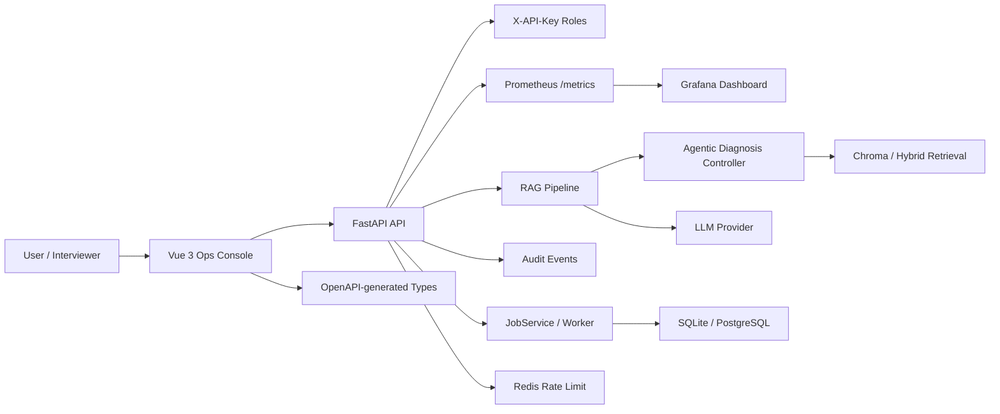

# Project A 架构设计：Agentic RAG Diagnosis Platform

> 目标：把设备售后诊断从“文档问答”升级为可追溯、可评测、可运维、可验收的 Agentic RAG 工程系统。

*图 1：从 Vue 3 控制台到 FastAPI、Agentic RAG 核心、数据与任务、可观测与交付的五层架构总览*

## 系统架构

## 分层说明

| 层级 | 职责 | 展示价值 |
|---|---|---|
| Vue Ops Console | Acceptance、Architecture、Agentic RAG、Quality、System Status、Jobs 等演示页面 | 面试时能直接展示系统证据 |
| FastAPI API | 诊断、知识、工单、评测、审计、健康检查和指标接口 | 后端边界清晰 |
| Agentic Diagnosis Controller | 安全检查、query routing、adaptive retrieval、风险识别、trace persistence、ticket escalation | 不是单纯 Prompt 调用 |
| RAG Pipeline | 文档入库、query rewrite、hybrid retrieval、GraphRAG relations、citations | grounded answer 可追溯 |
| JobService / Worker | claim、heartbeat、cancel、retry、timeout、worker stress | 支持异步任务演进 |
| Observability | Request ID、structured errors、audit logs、Prometheus metrics、Grafana | 可排查、可运维 |
| Delivery Gate | pytest、ruff、frontend build、OpenAPI drift、secret scan、Docker、smoke、E2E | 可交付而不是只会本地跑 |

## 关键设计取舍

- **单诊断控制器优先**：Project A 不是多 Agent 协作平台，重点是把 RAG 诊断链路做深做稳。
- **证据优先**：回答必须带 citations 和 trace_id，资料不足时拒答或升级人工工单。
- **离线可演示 + 生产路径可解释**：SQLite/Chroma 适合 demo，PostgreSQL/Redis smoke 证明生产演进路径。
- **验收脚本优先于口头承诺**：用 final production acceptance 串起测试、构建、Docker、smoke、E2E 和安全扫描。

## API 与运行边界

*图 2：提问 → 检索与诊断 → 引用回答 → 拒答或工单升级 → 评测与审计的诊断主链路*

| 能力 | 说明 |
|---|---|
| `healthz` / `readyz` | 区分进程存活和依赖就绪 |
| Diagnosis APIs | 输入设备型号、故障码、现场现象，返回 grounded answer、citations、trace_id |
| Ticket Escalation | 高风险或资料不足时生成可人工处理的工单升级 |
| Evaluation APIs | 保存 regression cases、bad cases、trace review 证据 |
| Audit Events | 记录诊断、工单升级、评测、系统动作 |
| Prometheus `/metrics` | 暴露服务指标，Grafana 展示监控面板 |
