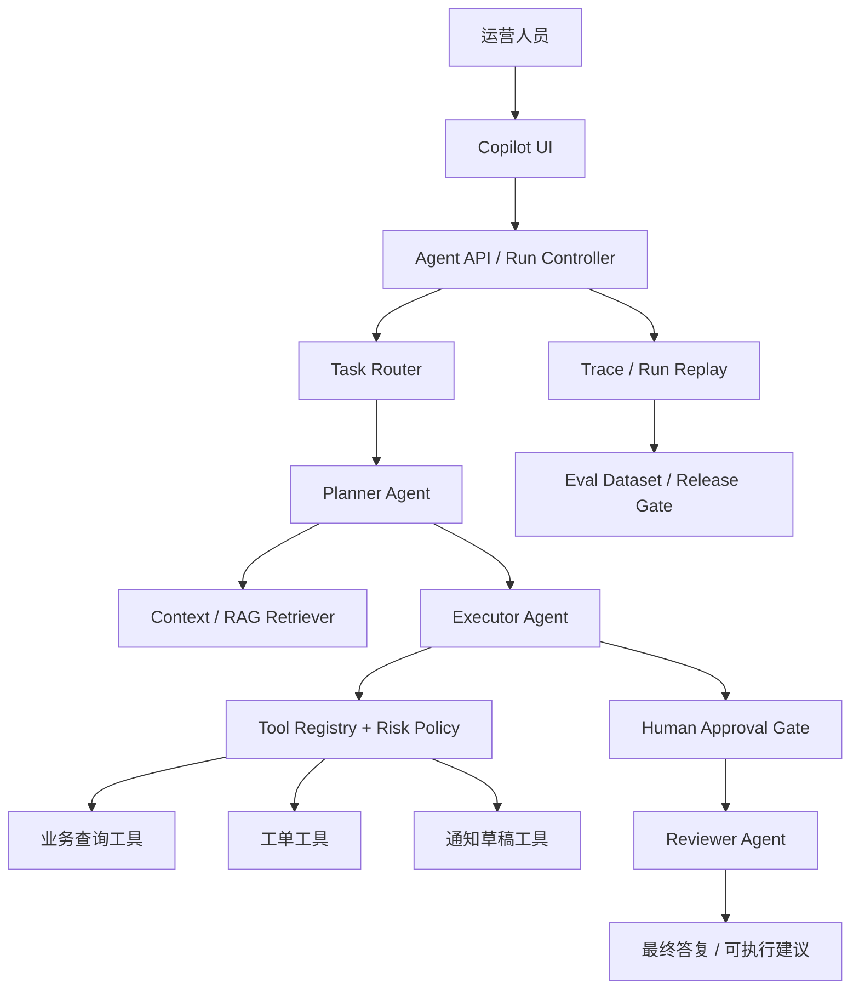
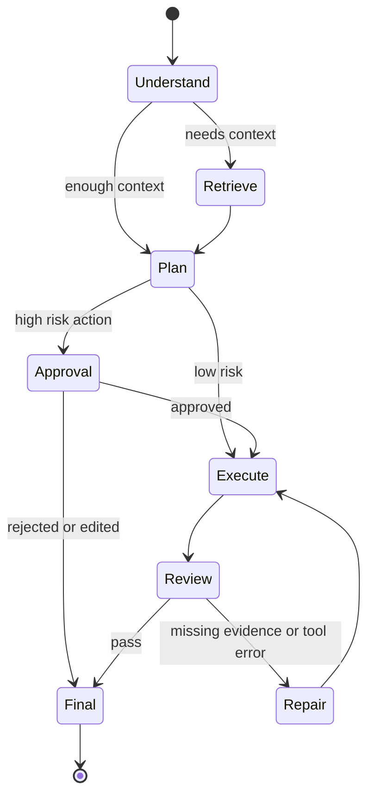

# 项目 B：运营中台多 Agent Copilot

> 目标：把一个“多 Agent 概念项目”做成可演示、可答辩、可写进简历的工程作品集。它不追求把所有企业系统都接完，而是重点展示 Agent Runtime、工具治理、人工审批、Trace / Evaluation 和上线门禁。

## 项目一句话

项目 B 是一个面向运营中台的 Multi-Agent Copilot：用户用自然语言提出运营任务，系统先理解任务、检索业务上下文、规划步骤，再调用受控工具完成查询、分析、草稿生成或工单创建；高风险动作进入人工审批，所有执行过程都记录 Trace，后续进入评测与复盘闭环。

## 业务场景

运营中台常见任务不是单轮问答，而是多步骤流程：

- 查询活动、订单、用户、库存或工单数据。
- 分析异常原因，例如转化率下降、投诉上升、库存预警。
- 生成运营动作草稿，例如通知文案、工单、复盘摘要。
- 对高风险动作进行审批，例如批量通知、修改配置、创建工单。

这些任务天然需要：上下文检索、工具调用、状态管理、人工确认和执行回放。

## 核心架构

## Agent 分工

| 角色 | 责任 | 输入 | 输出 |
|---|---|---|---|
| Task Router | 判断任务类型、风险等级、是否需要数据 | 用户输入、历史上下文 | task_type、risk_level、需要的工具范围 |
| Planner Agent | 拆解步骤，决定先查什么、再做什么 | task_brief、约束、工具清单 | plan、tool_call_candidates |
| Retriever | 检索业务知识、指标定义、历史 SOP | query、tenant、权限 | evidence_pack、citations |
| Executor Agent | 根据计划调用工具，处理结果 | plan、tool schema、risk policy | tool_results、intermediate_state |
| Reviewer Agent | 检查答案是否有证据、是否越权、是否需要审批 | tool_results、evidence、policy | final_answer、risk_notes、next_actions |
| Human Approver | 审批高风险动作 | action_preview、impact、rollback | approve / reject / edit |

## 状态机设计

## 工具设计

第一版不包装大量工具，只做少而强的 5 个工具：

| 工具 | 类型 | 风险 | 说明 |
|---|---|---|---|
| `search_metric_definition` | read | low | 查询指标口径、业务术语、SOP |
| `query_operation_snapshot` | read | medium | 查询活动、订单、用户或工单聚合数据 |
| `draft_operation_message` | write draft | low | 生成通知或运营动作草稿，不直接发送 |
| `create_ticket_draft` | write draft | medium | 生成工单草稿，等待人工确认 |
| `submit_approved_action` | external side effect | high | 只有审批通过后才能真正执行 |

## 可展示证据

- [Project B 架构设计](/projects/project-b-architecture)
- [Project B Demo 验收脚本](/projects/project-b-demo-script)
- [Project B Trace / Eval 方案](/projects/project-b-trace-eval-plan)
- [Project B 路线图](/projects/project-b-roadmap)
- [Project B 一分钟介绍](/note/Interview/project-b-one-minute)
- [Project B 深挖版](/note/Interview/project-b-deep-dive)
- [Project B STAR 故事库](/note/Interview/project-b-star-story-bank)

## 面试表达

> 我没有把 Project B 做成一个自由聊天机器人，而是把它设计成受控的 Agent Runtime：任务先经过 Router 判断类型和风险，再由 Planner 生成步骤，由 Executor 通过 Tool Registry 调用受控工具；高风险动作进入 Human-in-the-loop 审批；每个 run 都记录 Trace，并把失败样本沉淀进评测集。这样项目能展示的不只是“会调模型”，而是 Agent 系统工程化能力。

## 参考资料

- [LangGraph Documentation](https://langchain-ai.github.io/langgraph/)
- [OpenAI Agents SDK](https://openai.github.io/openai-agents-python/)
- [OpenTelemetry GenAI Semantic Conventions](https://opentelemetry.io/docs/specs/semconv/gen-ai/)
- [Model Context Protocol Documentation](https://modelcontextprotocol.io/docs/getting-started/intro)
