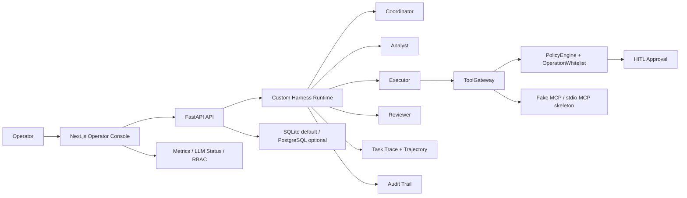

# Project B 架构设计：Multi-Agent Runtime Prototype

*图 1：Next.js Operator Console、FastAPI、四角色 Runtime、工具治理与可观测审计的五层架构总览*

## 架构目标

Project B 的核心不是“Agent 数量多”，而是把多角色协作、工具治理、人审、审计和轨迹可视化放进一个可演示的 Runtime。

## 角色分工

*图 2：任务创建 → 计划分析 → 工具调用 → 人工审批 → 受控执行 → 轨迹回放的治理执行链路*

| 角色 | 职责 | 输出 |
|---|---|---|
| Coordinator | 接收任务，组织执行流程，维护状态 | task plan、handoff |
| Analyst | 分析任务、生成查询或业务判断 | analysis result、NL2SQL draft |
| Executor | 通过 ToolGateway 执行受控工具 | tool result、approval request |
| Reviewer | 检查结果、风险、证据和策略 | reviewer verdict、final response |

## 治理层

| 模块 | 作用 |
|---|---|
| ToolGateway | 统一工具入口，隔离 Agent 和真实工具执行 |
| PolicyEngine | 判断工具是否允许、是否需要审批、是否命中风险策略 |
| OperationWhitelist | 限制可执行操作集合，避免模型自由调用任意动作 |
| Approval | 高风险动作进入人工确认，可 resume |
| Audit | 保存任务、工具、审批、策略和结果证据 |
| Trace / Trajectory | 展示多 Agent 执行轨迹，支持面试讲解和排障 |

## 运行边界

- 默认 fake/offline，保证面试演示不依赖外部服务。
- 可选真实 provider，但需要显式 opt-in。
- SQLite 是 demo 默认路径，PostgreSQL / Redis 是 pilot 演进路径。
- 项目是工程原型，不直接声明 public production ready。
