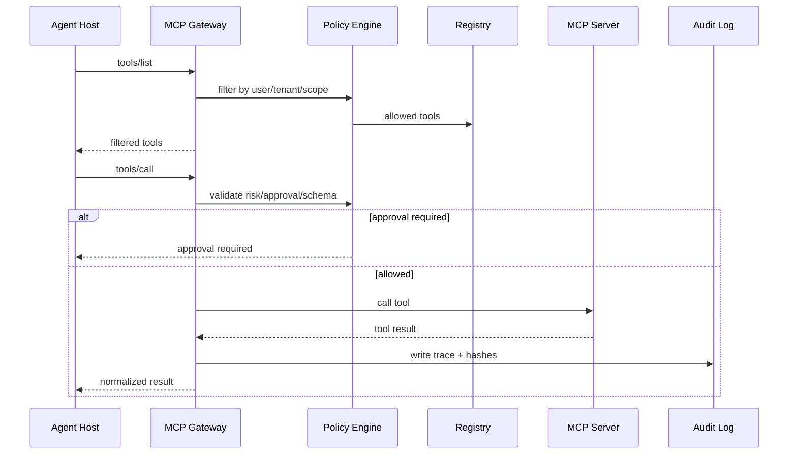

# Project C 架构设计：Enterprise MCP Gateway & Skill Hub

> 这页用于系统设计答辩：如何把多个 MCP Server、Skills、权限、安全扫描、审批和评测组织成一个企业级 Agent 扩展平台。

## 设计目标

Project C 的设计目标是让企业内部 Agent 能安全复用外部能力：

1. **统一发现**：统一展示 tools、resources、prompts 和 skills。
2. **统一治理**：统一 schema、风险等级、权限、版本和 owner。
3. **统一审计**：每次调用都能追踪 user、tenant、tool、input hash、output hash 和审批决策。
4. **统一评测**：工具和 Skill 改动必须跑 contract tests 和 regression cases。

## 分层架构

| 层级 | 模块 | 说明 |
|---|---|---|
| Client Layer | Claude / Codex / 自研 Agent / Web App | 通过 MCP Client 或 Gateway API 调用能力 |
| Gateway Layer | Discovery Proxy、Call Router、Rate Limiter | 转发 tools/list、resources/read、tools/call，并做统一策略 |
| Registry Layer | Tool Registry、Resource Catalog、Prompt Catalog | 存 schema、owner、risk、version、tags、description |
| Skill Layer | Skill Hub、Skill Evaluator、Skill Changelog | 管理 `SKILL.md`、references、scripts、assets 和测试 |
| Policy Layer | RBAC、Scope、Approval、Sandbox、Secret | 决定谁能看、谁能调、谁要审批 |
| Security Layer | Tool Poisoning Scanner、Prompt Injection Filter、Output Sanitizer | 防止工具描述、资源内容和工具返回诱导 Agent 越权 |
| Observability | Trace、Audit、Cost、Latency、Replay | 支撑排障、合规和优化 |
| Eval Layer | Contract Tests、Replay Tests、Skill Eval | 保障版本演进不破坏旧能力 |

## Registry 数据模型

```ts
interface ToolRegistryItem {
  name: string
  serverId: string
  owner: string
  version: string
  riskLevel: 'read' | 'write_draft' | 'write' | 'destructive'
  approvalPolicy: 'never' | 'on_risk' | 'always' | 'disabled'
  inputSchemaHash: string
  outputSchemaHash: string
  descriptionReviewStatus: 'pending' | 'approved' | 'rejected'
  allowedScopes: string[]
  evalSuite: string
  deprecatedAt?: string
}
```

## 调用链路



## 安全扫描

Project C 的安全扫描不替代人工审查，但能提供上线前门禁：

- description 是否包含“忽略系统指令”等可疑内容。
- tool 是否声明过宽参数，例如任意 shell command。
- resource 是否可能泄漏跨租户数据。
- prompt 是否诱导模型绕过审批。
- output 是否包含未经转义的指令型文本。

## 部署形态

| 形态 | 适用场景 | 备注 |
|---|---|---|
| Local Gateway | 个人开发、本地工具 | 启动快，但权限和审计有限 |
| Team Gateway | 小团队共享工具 | 适合项目协作和统一 schema |
| Enterprise Gateway | 多租户、RBAC、审计、审批 | 适合企业 Agent 平台 |
| Hosted Skill Hub | 管理 Skill 包、版本和 eval | 可与 Gateway 解耦部署 |

## 关键指标

- registered tools count
- approved tool ratio
- high-risk call approval rate
- rejected tool poisoning count
- tool call success rate
- schema error rate
- skill eval pass rate
- replay pass rate
- p95 gateway latency
- cost per successful run

## 面试表达

> Project C 的核心架构是 Gateway + Registry + Policy + Skill Hub + Eval。Gateway 负责统一协议入口，Registry 负责工具和资源元数据，Policy 负责权限和审批，Skill Hub 负责可复用工作流，Eval 负责版本回归。这个项目体现的是企业级 Agent 平台治理能力，而不是单个工具 demo。
