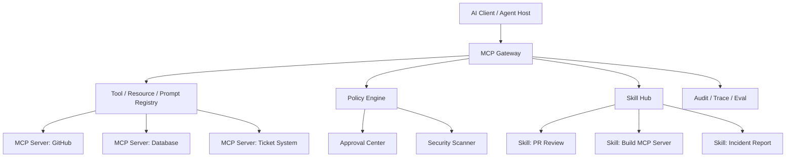

# Project C：企业 MCP Gateway 与 Skill Hub

> 目标：把 MCP Server 创建、工具治理、Skills 编写和 Agent UI 控制台组合成一个新的作品集项目。Project C 用来证明我不仅会接入工具，还能设计“企业级 Agent 扩展平台”。

## 项目一句话

Project C 是一个 Enterprise MCP Gateway & Skill Hub：它把企业内部 API、数据库、文件系统、工单系统和自动化脚本封装成标准 MCP Tools / Resources / Prompts，同时把常用 Agent 工作流沉淀成 Skills，通过统一控制台完成工具发现、权限审批、版本管理、安全扫描、调用审计和评测回归。

## 为什么需要 Project C

随着 Agent 能力从聊天走向实际操作，企业会遇到三个问题：

1. **工具太散**：不同团队各自包装 API，schema、错误码、权限和日志不一致。
2. **流程不可复用**：创建周报、巡检、PR Review、数据分析、MCP Server 生成等流程靠提示词复制。
3. **安全不可控**：工具描述可能被投毒，返回内容可能注入指令，高风险动作可能缺少审批和审计。

Project C 解决的是“Agent 扩展能力治理”问题。

## 核心能力

| 能力 | 说明 | 作品集价值 |
|---|---|---|
| MCP Gateway | 统一代理多个 MCP Server，管理 tools/resources/prompts | 展示协议理解和企业集成能力 |
| Tool Registry | 维护 schema、risk level、owner、version、approval policy | 展示工具治理能力 |
| Skill Hub | 管理 `SKILL.md`、references、scripts、assets、eval cases | 展示可复用工作流沉淀能力 |
| Security Scanner | 检查 tool description、prompt injection、越权 resource、危险 schema | 展示 Agent 安全能力 |
| Approval Center | 对写操作、外部副作用和高风险工具进行审批 | 展示 HITL 和审计能力 |
| Observability | 记录调用 trace、成本、延迟、错误、用户、租户和版本 | 展示生产运维能力 |
| Eval Gate | 对工具调用和 Skill 输出做回归测试 | 展示可持续维护能力 |

## 产品架构

## 关键设计

### 1. Gateway 不直接信任工具描述

MCP Server 暴露 tools 时，Gateway 会先做审查：

- 工具名是否稳定。
- description 是否包含可疑指令。
- input schema 是否过宽。
- 是否声明风险等级和 owner。
- 是否有测试样例和版本号。

### 2. Skill Hub 不只是提示词仓库

每个 Skill 都要包含：

- 触发边界。
- 默认流程。
- references 的渐进加载规则。
- scripts 和 assets。
- 验收命令。
- 回归样例。
- changelog。

### 3. 高风险工具必须进入审批

工具按风险分层：

| 风险 | 示例 | 策略 |
|---|---|---|
| read | 查询文档、读取指标 | 自动执行，记录日志 |
| write_draft | 生成工单草稿、生成 PR 评论草稿 | 自动生成草稿，不直接提交 |
| write | 创建工单、修改配置 | 二次确认或人工审批 |
| destructive | 删除数据、发送批量通知 | 默认禁止或强审批 |

## 可展示证据

- [Project C 架构设计](/projects/project-c-architecture)
- [Project C Gateway Console UI](/projects/project-c-gateway-console-ui)
- [Project C Demo 验收脚本](/projects/project-c-demo-script)
- [Project C 安全与评测方案](/projects/project-c-security-eval-plan)
- [Project C 一分钟介绍](/note/Interview/project-c-one-minute)
- [Project C 深挖问答](/note/Interview/project-c-deep-dive)

## 面试表达

> Project C 展示的是企业 Agent 扩展能力治理。我不是把每个 API 单独包装给模型调用，而是设计一个 MCP Gateway 和 Skill Hub：Gateway 统一管理工具、资源、Prompt、权限、审批和审计，Skill Hub 把重复流程沉淀成可版本化工作流。这样 Agent 能力可以被复用、被评测、被审计，也能控制工具投毒和越权风险。

## 参考资料

- [Model Context Protocol Documentation](https://modelcontextprotocol.io/docs/getting-started/intro)
- [MCP Server Concepts](https://modelcontextprotocol.io/docs/learn/server-concepts)
- [MCP Authorization](https://modelcontextprotocol.io/specification/draft/basic/authorization)
- [Agent Skills Overview](https://agentskills.io/)
- [OpenAI Apps SDK](https://developers.openai.com/apps-sdk/)
