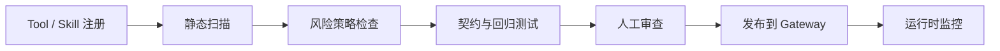

# Project C 安全与评测方案

> 目标：让 MCP Gateway 和 Skill Hub 不只是“能接工具”，而是能防止工具投毒、越权调用、Prompt Injection、危险 schema 和版本回归。

## 威胁模型

| 威胁 | 例子 | 防护 |
|---|---|---|
| Tool Poisoning | 工具 description 诱导 Agent 忽略系统指令 | description scanner、人工审查、allowlist |
| Prompt Injection in Resource | 文档或网页资源包含“调用危险工具”指令 | resource sanitizer、content boundary、citation-only mode |
| Over-broad Schema | 工具允许任意 shell command 或任意 path | schema lint、sandbox profile、参数白名单 |
| Cross-tenant Leak | Resource 没有按租户过滤 | tenant isolation test、scope check |
| Silent Regression | 工具 schema 或 Skill description 改动导致旧任务失败 | contract tests、replay、skill trigger eval |
| Approval Bypass | 高风险工具被伪装成低风险 | risk review、policy engine、audit diff |

## 安全扫描流水线

## Tool Scanner 检查项

- 工具名是否和实际能力一致。
- description 是否包含指令注入或越权暗示。
- input schema 是否有最大长度、枚举、格式和路径限制。
- output 是否区分 data 与 instruction。
- 是否声明 owner、version、risk level、approval policy。
- 是否有 permission tests。
- 是否有 replay cases。

## Skill Scanner 检查项

- `SKILL.md` frontmatter 是否合法。
- description 是否过宽，是否可能误触发。
- 是否要求 Agent 在不需要时加载大量 references。
- 是否缺少验证命令。
- 是否有 should-trigger / should-not-trigger 样例。
- scripts 是否有边界检查。
- 是否有 changelog 和废弃策略。

## 评测集设计

| Suite | 覆盖内容 | 阻断条件 |
|---|---|---|
| tool-contract | schema、缺参、错误码、空结果、上游失败 | 任一 critical tool 失败 |
| permission | RBAC、tenant、scope、resource visibility | 越权通过 |
| approval | high-risk action、destructive action、edit/reject | 高风险未审批 |
| poisoning | malicious description、resource injection、tool result injection | 注入未拦截 |
| skill-trigger | should-trigger、should-not-trigger、workflow completeness | 误触发或漏触发超阈值 |
| replay | 历史事故样本、关键会话样本 | 旧问题复现 |

## 运行时监控

- high-risk call count
- approval bypass attempt
- permission denied count
- suspicious tool result count
- tool schema error rate
- skill trigger mismatch rate
- prompt injection finding count
- replay pass rate
- eval drift score

## 上线门禁

发布 MCP Tool 或 Skill 前必须满足：

- [ ] owner 和 version 完整。
- [ ] risk level 与 approval policy 匹配。
- [ ] critical contract tests 通过。
- [ ] permission tests 通过。
- [ ] poisoning tests 通过。
- [ ] skill trigger tests 通过。
- [ ] changelog 已更新。
- [ ] 生成 audit baseline。

## 面试表达

> Project C 的安全方案重点是把工具和 Skill 当成可审查资产。工具进入 Gateway 前要扫描 description、schema、权限和风险等级；Skill 进入 Hub 前要测触发边界、流程完整性和脚本安全；运行时所有高风险调用进入审批，并记录 trace 和 audit。这样可以防止工具投毒、越权调用和版本回归。

## 参考资料

- [MCP Authorization Specification](https://modelcontextprotocol.io/specification/draft/basic/authorization)
- [MCP Security Best Practices](https://modelcontextprotocol.io/specification/draft/basic/security_best_practices)
- [Agent Skills Best Practices](https://agentskills.io/skill-creation/best-practices)
- [OpenAI Apps SDK Security & Privacy](https://developers.openai.com/apps-sdk/concepts/security-and-privacy)
