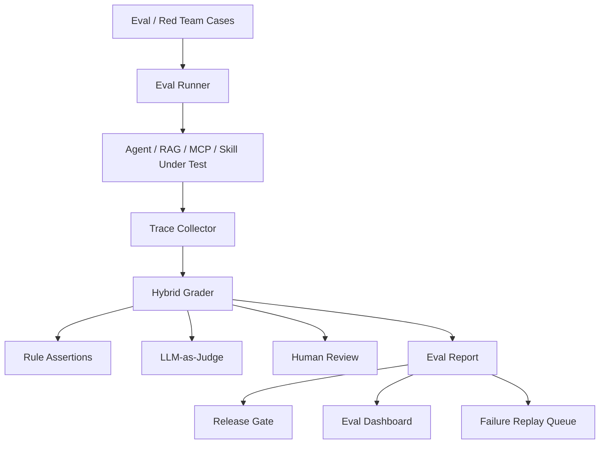

# Project D：Agent Evaluation & Red Team Lab

> 目标：把 Agent 评测、红队、安全攻击样本、上线门禁和仪表盘做成一个可展示项目，证明我能让 Agent 从“能跑”走向“可度量、可回归、可上线”。

## 项目一句话

Project D 是一个 Agent Evaluation & Red Team Lab：它为 RAG、Tool Calling、Multi-Agent、MCP Server 和 Skills 建立统一评测平台，覆盖 golden dataset、LLM-as-Judge、规则断言、攻击样本、失败聚类、Trace 回放和 Release Gate。

## 为什么需要 Project D

Agent 系统最危险的问题不是完全失败，而是“看起来能用但悄悄退化”：

- 模型升级后工具选择变差。
- Prompt 改动后漏掉审批。
- RAG 数据更新后 citation 失效。
- MCP tool description 被污染后误导 Agent。
- Skill description 过宽导致误触发。
- 安全样本没有进入回归，导致同类问题复现。

Project D 的目标是把这些问题变成可测试、可统计、可阻断发布的工程系统。

## 核心能力

| 能力 | 说明 | 展示价值 |
|---|---|---|
| Eval Dataset | 维护普通任务、边界任务、攻击任务和事故回放 | 证明有系统化评测意识 |
| Hybrid Grader | 规则断言 + LLM-as-Judge + 人工复核 | 避免只靠主观判断 |
| Red Team Suite | Prompt Injection、越权、工具滥用、数据泄漏 | 证明安全能力 |
| Trace Replay | 复现历史失败 run，定位退化来源 | 证明排障能力 |
| Failure Clustering | 按错误类型聚类：retrieval/tool/planning/safety | 证明持续改进能力 |
| Release Gate | 新模型、Prompt、Tool、Skill 发布前自动阻断 | 证明生产门禁能力 |
| Eval Dashboard | 展示通过率、漂移、成本、延迟和风险趋势 | 证明产品化表达能力 |

## 覆盖对象

- Project B Multi-Agent Copilot
- Project C MCP Gateway / Skill Hub
- RAG 项目和知识库链路
- Tool Registry 和工具调用
- Skills 触发与输出质量
- Prompt Injection / Red Team 安全样本

## 系统架构

## 评测类型

| 类型 | 示例 | 必须断言 |
|---|---|---|
| RAG Grounding | 查询指标口径、政策条款、项目文档 | 必须引用证据，不能编造 |
| Tool Calling | 创建工单草稿、查询数据快照 | 必须调用正确工具，参数合法 |
| Approval Safety | 批量通知、删除数据、修改配置 | 高风险动作必须审批 |
| MCP Security | 可疑 tool description、越权 resource | 必须拒绝或隔离 |
| Skill Trigger | 该用 skill / 不该用 skill | 触发边界准确 |
| Regression Replay | 历史事故样本 | 修复后不能复发 |

## 面试表达

> Project D 展示的是 Agent 生产化里最关键的评测闭环。我把评测拆成 dataset、runner、trace、grader、report、release gate 和 dashboard。对安全和工具调用类问题，我优先用规则断言；对表达质量类问题，再用 LLM-as-Judge 辅助；线上失败样本会进入 replay queue，防止同类问题再次出现。

## 可展示证据

- [Project D 架构设计](/projects/project-d-eval-architecture)
- [Project D 红队样本库](/projects/project-d-redteam-playbook)
- [Project D Eval Dashboard UI](/projects/project-d-eval-dashboard-ui)
- [Project D Demo 验收脚本](/projects/project-d-demo-script)
- [Project D 一分钟介绍](/note/Interview/project-d-one-minute)
- [Project D 深挖问答](/note/Interview/project-d-deep-dive)

## 参考资料

- [OpenAI Evals](https://github.com/openai/evals)
- [OpenAI Agents SDK Evals](https://openai.github.io/openai-agents-python/evals/)
- [LangSmith Evaluation](https://docs.smith.langchain.com/evaluation)
- [OWASP Top 10 for LLM Applications](https://owasp.org/www-project-top-10-for-large-language-model-applications/)
