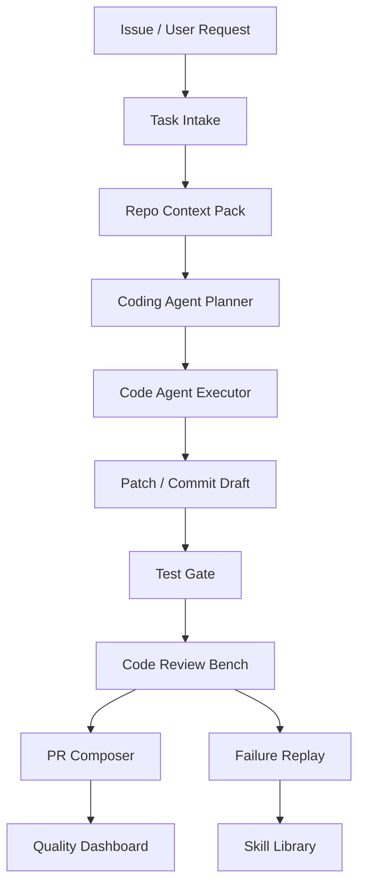

# Project E：AI Coding Agent Workbench / Repo Automation Lab

> 目标：把 AI 编程工具从“个人提效”升级成“团队级代码代理工程化平台”：能分派任务、生成改动、跑测试、做代码审查、创建 PR、回放失败、沉淀 Skills，并用评测门禁衡量质量。

## 项目一句话

Project E 是一个 AI Coding Agent Workbench：面向真实仓库协作，把 Codex / Claude Code / Copilot / 自研代码 Agent 的任务分派、代码修改、测试验证、PR 审查、浏览器验收、安全扫描和知识沉淀统一到一个工作台里。

## 为什么需要 Project E

AI Coding Agent 不应该只是“让模型写代码”。真实团队更关心：

- 任务是否理解清楚。
- 改动是否只在目标范围内。
- 测试是否真的跑过。
- PR 是否有可读说明。
- 代码审查是否能发现风险。
- 失败是否能回放。
- 好的工作流是否能沉淀成 Skill。

Project E 解决的是“AI 编程协作如何进入工程流程”的问题。

## 核心能力

| 能力 | 说明 | 展示价值 |
|---|---|---|
| Task Intake | 把 issue / 需求 / bug 转成 agent-ready task brief | 需求澄清能力 |
| Repo Context Pack | 自动收集相关文件、测试、约束和历史决策 | Context Engineering |
| Agent Execution | 调用 Codex / Claude Code / Copilot / 自研 Agent 执行 | AI Coding 工具链能力 |
| Test Gate | lint、unit、build、e2e、browser acceptance | 验证意识 |
| Code Review Bench | 用规则、LLM reviewer 和人工复核做 PR 审查 | 代码质量能力 |
| PR Composer | 生成 PR 描述、风险说明、验证证据和回滚方案 | 协作能力 |
| Failure Replay | 把失败日志、diff、测试命令沉淀成回归样例 | Debug 能力 |
| Skill Library | 把重复流程沉淀成项目 Skill | 可复用工作流能力 |

## 系统架构

## 典型任务

| 任务 | Agent 行为 | 验收 |
|---|---|---|
| 修复构建失败 | 读取日志、定位文件、改代码、跑构建 | build exit 0 |
| 新增前端组件 | 创建组件、样式、文档、截图验收 | build + browser smoke |
| 补测试 | 找未覆盖逻辑、写测试、跑测试 | test pass + coverage diff |
| PR Review | 阅读 diff、识别 bug、提出建议 | review finding quality |
| 文档重组 | 批量改 Markdown、更新导航、构建验证 | VitePress build pass |
| Skill 生成 | 把重复流程变成 SKILL.md + scripts | trigger eval pass |

## 可展示证据

- [Project E 架构设计](/projects/project-e-architecture)
- [Project E Repo Automation Console UI](/projects/project-e-repo-automation-console-ui)
- [Project E Code Review Bench](/projects/project-e-code-review-bench)
- [Project E Demo 验收脚本](/projects/project-e-demo-script)
- [Project E 安全与评测方案](/projects/project-e-safety-eval-plan)
- [Project E 一分钟介绍](/note/Interview/project-e-one-minute)
- [Project E 深挖问答](/note/Interview/project-e-deep-dive)

## 面试表达

> Project E 展示的是 AI Coding Agent 工程化。我不是只让模型生成代码，而是把任务理解、上下文打包、代码执行、测试门禁、代码审查、PR 描述、失败回放和 Skill 沉淀串成一个流程。这样可以证明我会把 AI 编程工具接入团队协作，而不是只用它写一次性代码。

## 参考资料

- [GitHub Copilot coding agent](https://docs.github.com/en/copilot/using-github-copilot/coding-agent/about-assigning-tasks-to-copilot)
- [Claude Code Documentation](https://docs.anthropic.com/en/docs/claude-code/overview)
- [OpenAI Codex Documentation](https://developers.openai.com/codex/)
- [Aider Documentation](https://aider.chat/docs/)
