# Project F 架构设计：从文档解析到知识运营

> 这页用于面试深挖：为什么不能直接把 PDF 切块进向量库？如何设计可追溯、可复核、可评测的多模态文档智能系统？

## 架构目标

Project F 的架构目标不是“识别文字”，而是把复杂文档变成可治理的知识资产：

1. **解析可靠**：文本、表格、图片、扫描件都能进入统一元素模型。
2. **输出可用**：字段抽取遵循 schema，能进入业务系统。
3. **引用可追**：每个字段和 chunk 能回到页码、bbox、原文 span。
4. **安全可控**：敏感信息在入库前被脱敏、分级或隔离。
5. **质量可评测**：解析、抽取、入库、问答都能被数据集回归验证。
6. **运营可持续**：版本、过期、重解析、复核和回滚形成生命周期。

## 分层架构

```mermaid
flowchart LR
  subgraph UI["Review Console"]
    Upload["Upload Queue"]
    PageViewer["Page Viewer"]
    FieldPanel["Field Review"]
    EvalPanel["Quality Panel"]
  end

  subgraph Control["Document Control Plane"]
    Intake["Intake API"]
    Router["Parser Router"]
    Job["Job Orchestrator"]
    Policy["Policy Engine"]
  end

  subgraph Parse["Parsing Runtime"]
    Native["Native Text Parser"]
    OCR["OCR Worker"]
    VLM["Vision LLM Worker"]
    Layout["Layout Normalizer"]
  end

  subgraph Knowledge["Knowledge Ops"]
    Extract["Structured Extractor"]
    Redact["PII Redactor"]
    Review["Human Review Store"]
    Gate["Ingestion Gate"]
    Index["Vector + Keyword Index"]
  end

  UI --> Control
  Control --> Parse
  Parse --> Knowledge
  Knowledge --> UI
```



## 核心模块

| 模块 | 职责 | 关键数据 |
|---|---|---|
| Intake API | 上传、去重、hash、租户隔离、权限标签 | file_hash、tenant_id、source_type |
| Parser Router | 判断 native / OCR / VLM / mixed strategy | quality_score、parser_strategy |
| Job Orchestrator | 分页并发、重试、超时、成本预算 | job_id、page_range、retry_count |
| Layout Normalizer | 把不同解析器输出变成统一元素模型 | element_type、page、bbox、text |
| Structured Extractor | 用 schema 抽取字段、风险和摘要 | field_name、value、confidence |
| PII Redactor | 识别和脱敏敏感字段，生成权限标签 | pii_type、mask_policy、audit_id |
| Human Review Store | 保存人工修改、原因和版本 | reviewer、change_reason、approved_at |
| Ingestion Gate | chunk、引用、ACL、重复和 freshness 检查 | gate_score、blocking_issues |
| Knowledge Index | 存储可检索 chunks 和结构化 metadata | chunk_id、embedding、acl、version |

## 统一元素模型

多模态解析最重要的是把不同解析器结果归一化。Project F 使用 `DocumentElement`：

```ts
type DocumentElement = {
  elementId: string
  documentId: string
  page: number
  type: 'title' | 'paragraph' | 'table' | 'image' | 'caption' | 'footnote' | 'header' | 'footer'
  text?: string
  tableMarkdown?: string
  imageRef?: string
  bbox: [number, number, number, number]
  confidence: number
  parser: 'native' | 'ocr' | 'vlm' | 'manual'
  sourceHash: string
}
```

这个模型让后续抽取、复核、chunking、引用和回放都不依赖某一个解析器。

## 数据流

1. 用户上传文档，系统计算 hash，识别租户、业务类型和访问权限。
2. Detector 判断文档是否可原生抽取、是否扫描件、是否包含复杂图表。
3. Parser Router 为每页选择 native / OCR / VLM / mixed。
4. Layout Normalizer 输出统一元素模型。
5. Structured Extractor 生成字段、摘要、风险和引用。
6. PII Redactor 按策略脱敏或打权限标签。
7. 低置信字段进入 Human Review Queue。
8. Ingestion Gate 检查引用覆盖、chunk 质量、ACL、重复和 freshness。
9. 通过门禁后写入 Knowledge Store 和索引。
10. Grounded QA Agent 回答时必须返回 source_id、page、bbox 和原文片段。

## 失败与降级

| 失败点 | 降级策略 | 用户可见反馈 |
|---|---|---|
| 文件损坏 | 标记为 intake_failed，不进入解析 | 上传队列显示失败原因 |
| OCR 低置信 | 切换 VLM 或进入人工复核 | 页级 quality badge |
| 表格解析失败 | 保留截图 + 人工标注入口 | 表格卡显示待复核 |
| Schema 校验失败 | 重试一次，仍失败则进入 review | 字段面板显示 schema error |
| PII 未确认 | 阻断入库 | Gate 显示 blocking issue |
| 引用缺失 | 阻断问答使用 | QA 不使用该 chunk |

## 可观测性

每个文档任务需要记录：

- `parse.strategy`：每页使用的解析策略。
- `parse.latency_ms`：解析耗时。
- `parse.cost_estimate`：模型/OCR成本估算。
- `extract.schema_pass_rate`：结构化输出通过率。
- `review.low_confidence_count`：低置信字段数量。
- `ingestion.blocking_issue_count`：入库阻断问题数量。
- `rag.citation_coverage`：可引用 chunk 比例。
- `qa.grounded_answer_rate`：回答带引用比例。

## 面试讲法

> 我把系统拆成 Document Control Plane、Parsing Runtime 和 Knowledge Ops 三层。Control Plane 负责上传、路由、权限和任务编排；Parsing Runtime 负责 native/OCR/VLM 多策略解析；Knowledge Ops 负责结构化抽取、脱敏、复核、入库门禁和索引。这样做的好处是解析器可以替换，知识治理逻辑不会被某个 OCR 或 VLM 供应商绑死。
