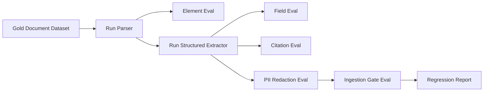

# Project F Ingestion Eval Plan：文档解析与入库质量评测

> 这页用于说明 Project F 如何评测：不仅评估最终问答，还要评估文档解析、结构化抽取、引用、脱敏和入库门禁。

## 评测目标

Project F 的评测分为 5 层：

1. **Parser Eval**：版面元素是否识别正确。
2. **Extraction Eval**：结构化字段是否准确。
3. **Citation Eval**：字段和回答是否能回到正确页码和 bbox。
4. **PII Eval**：敏感信息是否识别、脱敏、阻断到位。
5. **RAG Ingestion Eval**：入库 chunk 是否可检索、可引用、可更新。

## 评测数据集

| 数据集 | 样本 | 覆盖问题 |
|---|---|---|
| Contract Set | 合同、补充协议、扫描章页 | 条款抽取、日期金额、风险识别 |
| Invoice Set | 发票、报销单、回单 | 金额、税号、PII、表格 |
| Manual Set | 设备手册、维修记录、截图 | 多层标题、步骤、适用型号 |
| Report Set | 研报、图表、表格 | 图表解释、数字一致性 |
| Adversarial Set | 模糊扫描、旋转页面、水印、跨页表格 | 解析鲁棒性 |

## 指标设计

| 指标 | 计算方式 | 目标 |
|---|---|---|
| Element F1 | title/paragraph/table/image 元素识别 F1 | 0.85+ |
| Table Structure Accuracy | 表格行列、合并单元格、标题识别准确率 | 0.80+ |
| Field Exact Match | schema 字段值与 gold 对比 | 0.90+ |
| Numeric Consistency | 金额、日期、比例等数值一致性 | 0.95+ |
| Citation Coverage | 有引用的字段 / 总字段 | 0.95+ |
| Citation Accuracy | 引用 bbox 是否覆盖 gold span | 0.90+ |
| PII Recall | 已识别 PII / gold PII | 0.98+ |
| Gate Blocking Precision | 阻断原因是否真实有效 | 0.90+ |
| Retrieval Hit@5 | 查询能否检索到正确 chunk | 0.85+ |

## 评测流水线



## 样例评测用例

```yaml
case_id: contract_effective_date_001
document: contract-2026-001.pdf
task: extract_contract_metadata
gold:
  effective_date:
    value: "2026-06-01"
    page: 2
    text_span: "本合同自 2026 年 6 月 1 日起生效"
  total_amount:
    value: 1280000
    currency: "CNY"
    page: 5
checks:
  - field_exact_match
  - citation_page_match
  - citation_span_overlap
  - schema_validation
```

## 错误分类

| 错误类型 | 例子 | 修复方向 |
|---|---|---|
| Layout Miss | 表格被识别成普通段落 | 改 parser strategy 或表格后处理 |
| OCR Noise | “2026” 被识别成 “202G” | OCR 置信阈值 + 数值校验 |
| Schema Drift | 模型输出多余字段或漏字段 | Structured Outputs + schema retry |
| Citation Missing | 字段有值但没有页码/bbox | 强制引用契约 |
| PII Leak | 手机号进入明文 chunk | 入库前 PII gate |
| Chunk Fragmentation | 一条条款被切成多个无意义片段 | layout-aware chunking |
| Permission Loss | ACL 没有写入 metadata | ingestion schema gate |

## Release Gate

一个新解析器、模型或 prompt 只有满足下面条件才允许上线：

- Parser Eval 不低于当前线上版本 98%。
- PII Recall 不能下降。
- Citation Coverage 不能低于 95%。
- blocking issue 的误阻断率不能明显上升。
- 至少通过 Contract / Invoice / Manual 三类核心数据集。
- 失败样本必须进入 regression set。

## 面试讲法

> 我不会只用最终问答准确率评估文档智能，因为错误可能发生在解析、抽取、引用、脱敏、chunking 和检索任意一层。我会把评测拆成 Element F1、Field Exact Match、Citation Accuracy、PII Recall、Retrieval Hit@5 和 Gate Blocking Precision。这样才能定位到底是 OCR 错、schema 错、引用错，还是入库质量差。
