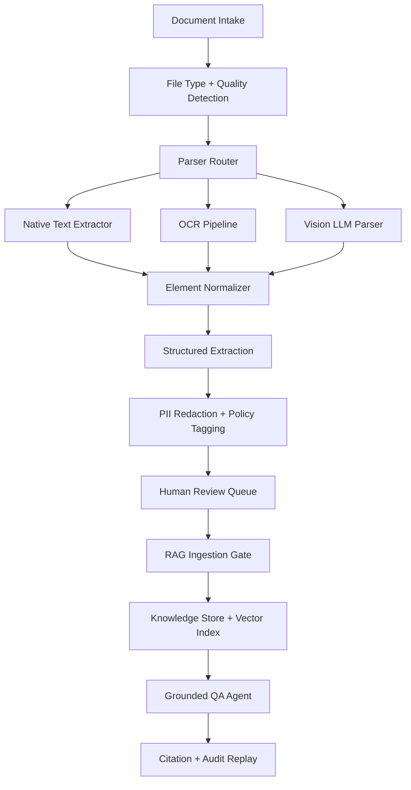

# Project F：Multimodal Document Intelligence / Knowledge Ops Agent

> 目标：把“上传 PDF 然后问答”升级成企业级文档智能工作流：能解析版面、抽取表格和图片、生成结构化字段、保留引用证据、做 PII 脱敏、进入人工复核，并把结果纳入可治理的知识生命周期。

## 项目一句话

Project F 是一个多模态文档智能与知识运营 Agent：面向合同、报告、发票、投标书、设备手册、论文和截图等复杂资料，把 OCR / Layout Parsing / Vision LLM / Structured Output / RAG Ingestion / Human Review / Governance 串成一个可演示、可评测、可上线的知识处理平台。

## 为什么需要 Project F

很多 RAG 项目失败不是因为向量库不好，而是因为进入知识库之前的文档质量太差：

- PDF 被粗暴转文本，表格、页眉、脚注、图注和跨页段落丢失。
- 图片和扫描件没有 OCR 或视觉理解。
- 抽取结果没有 schema，后续无法进入业务系统。
- 没有引用坐标，回答时无法回到原文页码。
- 包含身份证号、手机号、合同金额等敏感信息，却没有脱敏和审计。
- 知识入库后没有版本、失效、复核和回滚机制。

Project F 重点展示“文档进入 Agent 系统之前应该如何工程化治理”。

## 核心能力

| 能力 | 说明 | 展示价值 |
|---|---|---|
| Document Intake | 支持 PDF、扫描件、图片、Office 文档和批量目录上传 | 数据入口工程 |
| Layout Parsing | 按页识别标题、段落、表格、图像、页眉页脚、脚注 | 多模态解析能力 |
| OCR / Vision Routing | 根据文档质量选择文本抽取、OCR、VLM 或混合策略 | 成本与质量取舍 |
| Structured Extraction | 用 JSON Schema 抽取合同方、金额、日期、风险条款等字段 | 输出可集成 |
| Citation Grounding | 保存 page、bbox、source span、confidence、parser version | 可追溯问答 |
| PII Redaction | 对身份证号、手机号、邮箱、地址、银行卡等做脱敏和权限控制 | 安全合规 |
| Human Review | 低置信字段进入人工复核队列，保留修改原因 | 人机协同 |
| RAG Ingestion Gate | 入库前做 chunk 质量、引用覆盖、去重、权限标签和 freshness 检查 | 可靠知识库 |
| Knowledge Ops | 版本、过期、重解析、回滚、评测集和运营指标 | 知识生命周期 |

## 系统架构



## 典型业务场景

| 场景 | 输入 | 输出 | 关键验收 |
|---|---|---|---|
| 合同审查 | 合同 PDF、扫描章页、补充协议 | 合同元数据、风险条款、引用页码 | 字段准确率、引用覆盖率、低置信复核 |
| 投标资料整理 | 多个 PDF、表格和图片 | 资质清单、缺失材料、时间线 | 跨文档去重、附件完整性 |
| 设备手册知识库 | 手册 PDF、故障截图、维修记录 | 可问答知识块、步骤引用、适用型号 | chunk 质量、版本 freshness |
| 财务票据归档 | 发票、报销单、银行回单 | 金额、税号、日期、供应商 | PII 脱敏、异常金额标记 |
| 研究报告摘要 | 研报、图表、表格 | 结构化摘要、指标表、引用证据 | 图表识别、数值一致性 |

## 关键设计取舍

### 1. 不把所有文档都交给 VLM

VLM 能看图，但成本和延迟更高。Project F 使用 Parser Router：

1. 原生文本可抽取：优先走 PDF text / Office parser。
2. 扫描件或低质量图片：走 OCR。
3. 复杂版面、图表和截图：走 VLM 或高精度 layout parser。
4. 低置信页：进入人工复核，而不是强行入库。

这样既能展示多模态能力，也能体现工程成本意识。

### 2. 抽取结果必须有 schema 和引用

项目不只生成“看起来合理”的摘要，而是输出可验证结构：

```json
{
  "document_id": "contract-2026-001",
  "fields": [
    {
      "name": "effective_date",
      "value": "2026-06-01",
      "confidence": 0.94,
      "citation": {
        "page": 2,
        "bbox": [120, 310, 420, 346],
        "text_span": "本合同自 2026 年 6 月 1 日起生效"
      }
    }
  ],
  "risk_flags": ["auto_renewal", "uncapped_liability"]
}
```

面试时重点讲：字段、置信度、引用坐标、模型版本和人工复核记录一起保存，后续才能审计和回放。

### 3. RAG 入库前必须有质量门禁

Project F 把 ingestion gate 做成独立阶段：

- chunk 是否过长或过短。
- 每个 chunk 是否有 source_id、page、bbox、acl、parser_version。
- 引用覆盖率是否达标。
- 表格是否保留行列结构。
- PII 是否已脱敏或打权限标签。
- 重复文档是否被识别。
- 旧版本是否需要重解析或下线。

## 可展示证据

- [Project F 架构设计](/projects/project-f-architecture)
- [Project F Document Review Console UI](/projects/project-f-document-review-console-ui)
- [Project F Ingestion Eval Plan](/projects/project-f-ingestion-eval-plan)
- [Project F Demo 验收脚本](/projects/project-f-demo-script)
- [Project F 安全与治理方案](/projects/project-f-security-governance)
- [Project F 一分钟介绍](/note/Interview/project-f-one-minute)
- [Project F 深挖问答](/note/Interview/project-f-deep-dive)

## 面试表达

> Project F 展示的是文档智能和 RAG 之间最容易被忽略的一层。我不是直接把 PDF 切块进向量库，而是先做文档质量检测、版面解析、OCR/VLM 路由、结构化抽取、引用坐标、PII 脱敏、人工复核和入库门禁。这样可以证明我理解多模态文档进入知识库之前的工程治理，而不是只会做一个问答 Demo。

## 参考资料

- [OpenAI Images and Vision](https://platform.openai.com/docs/guides/images-vision)
- [OpenAI Structured Outputs](https://platform.openai.com/docs/guides/structured-outputs)
- [OpenAI Agent Evals](https://platform.openai.com/docs/guides/agent-evals)
- [Unstructured Partitioning](https://docs.unstructured.io/open-source/core-functionality/partitioning)
- [LlamaParse Overview](https://developers.api.llamaindex.ai/cloud/llamaparse)
- [OWASP Top 10 for LLM Applications](https://owasp.org/www-project-top-10-for-large-language-model-applications)
