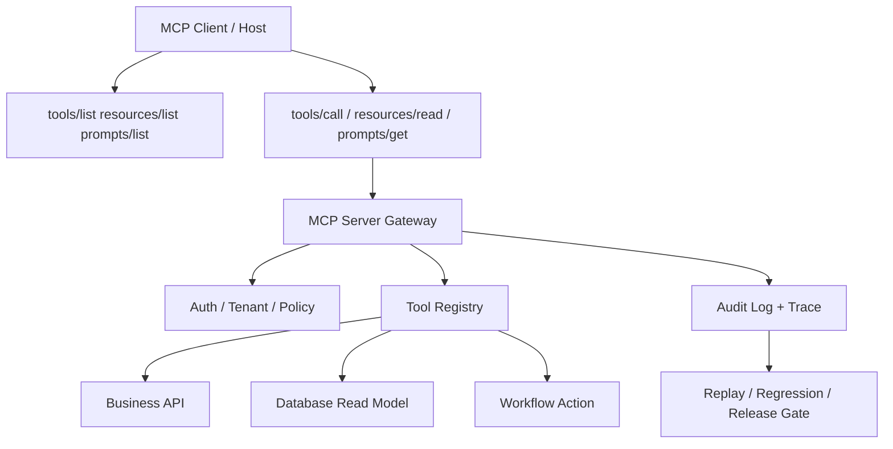

# MCP Server 面试与项目答辩 Playbook

> 目标：把 MCP Server 从“会写 demo”讲成“能设计、能治理、能上线、能排障”的工程能力。

## 30 秒回答

MCP Server 是把外部系统能力标准化暴露给 AI 客户端的协议服务。它不是简单把 API 包一层，而是要把工具、资源、Prompt、权限、审计、错误处理、部署方式和测试体系一起设计好。

## 面试官真正想听什么

| 问题 | 低质量回答 | 高质量回答 |
|---|---|---|
| MCP 解决什么问题 | 让模型调用工具 | 让多个 AI 客户端以标准协议发现和调用外部系统能力 |
| Tool 怎么设计 | 写函数给模型调 | 设计单一职责、强 schema、风险等级、错误码、幂等性和审批策略 |
| Resource 有什么用 | 读文件 | 以 URI / template 暴露上下文数据，并由客户端决定是否注入模型上下文 |
| Prompt 有什么用 | 提示词模板 | 把领域工作流参数化，让用户显式触发可重复流程 |
| 怎么上线 | 配置一下客户端 | 选择 stdio / Streamable HTTP / MCPB，补齐 auth、日志、限流、监控和版本策略 |

## 系统设计白板

## 必讲 6 个工程点

### 1. Tool Contract

每个工具必须说明：

- `name`：稳定、短、动宾结构。
- `description`：包含适用场景和不适用场景。
- `inputSchema`：字段类型、范围、枚举、必填项。
- `output`：成功结构、失败结构、用户可读摘要、机器可读 code。
- `riskLevel`：read / write / destructive / external side effect。
- `approvalPolicy`：自动、二次确认、人工审批。

### 2. Resources 与权限过滤

Resource 不应该绕过业务权限。资源 URI、模板参数、分页、缓存都要和租户、角色、数据权限绑定。尤其是企业 RAG 或数据库场景，不能因为 Agent 请求上下文就泄漏用户无权查看的数据。

### 3. Elicitation 的边界

MCP Elicitation 允许 Server 通过 Client 向用户请求补充信息。设计上要把它当作“受控表单交互”，不是让 Server 私自收集秘密。敏感信息应走专门授权或 URL 流程，不要通过普通表单塞进模型上下文。

### 4. 传输与部署选择

| 方案 | 适合场景 | 风险 |
|---|---|---|
| stdio | 本地开发、个人工具、原型 | 分发成本高，stdout 日志会破坏协议消息 |
| Streamable HTTP | 云 API、团队服务、企业集成 | 需要处理认证、限流、租户和网络稳定性 |
| MCPB / bundle | 需要访问本机资源但希望降低安装门槛 | 要管理运行时、依赖和升级 |
| MCP App / widget | 需要表单、选择器、图表等交互 UI | 前端安全、状态同步和兼容性更复杂 |

### 5. 测试策略

- `tools/list` 快照测试：schema 变更必须审查。
- `tools/call` 契约测试：正常、缺参、越权、上游超时、空结果。
- Resource 权限测试：不同租户、不同角色、无权限数据。
- Elicitation 测试：accept / decline / cancel 三种路径。
- 端到端测试：真实客户端或 Inspector 验证可发现、可调用、可解释。

### 6. 可观测性

至少记录：

- client / user / tenant / tool / schemaVersion
- latency / timeout / retry / upstream status
- approval decision / risk level
- input hash / output hash / trace id
- error code / failure category / replay payload

## 面试追问速答

### Q1：MCP Tool 和普通 function calling 有什么区别？

普通 function calling 通常绑定在某个模型调用或应用内部；MCP 是客户端和外部能力之间的标准协议，可以跨客户端发现和调用工具、资源、Prompt。工程重点也从“函数能不能跑”变成“协议、权限、部署、审计、版本是否可治理”。

### Q2：如何避免 Agent 调错工具？

工具命名要稳定，description 要写清适用/不适用场景，schema 要限制输入范围；同时用 contract tests 和 conversation regression tests 覆盖常见误调用场景，并在 Trace 中记录 tool selection reason。

### Q3：MCP Server 出问题怎么排查？

先分层定位：客户端 discovery 是否成功、schema 是否兼容、参数是否通过校验、权限是否拒绝、上游 API 是否失败、返回内容是否被客户端解析。每层都要有 trace id 和错误码。

## 作品集表达模板

> 我做 MCP Server 时不是只包装 API，而是先做 Tool Contract 设计：定义工具职责、schema、风险等级、审批和错误码；再做 Resources 权限过滤和 Prompt 工作流；最后用 Inspector、contract test、权限用例和 trace replay 验证上线稳定性。

## 参考资料

- [MCP Server Concepts](https://modelcontextprotocol.io/docs/learn/server-concepts)
- [Build an MCP Server](https://modelcontextprotocol.io/docs/develop/build-server)
- [MCP Elicitation](https://modelcontextprotocol.io/docs/concepts/elicitation)
- [Build with Agent Skills](https://modelcontextprotocol.io/docs/develop/build-with-agent-skills)
