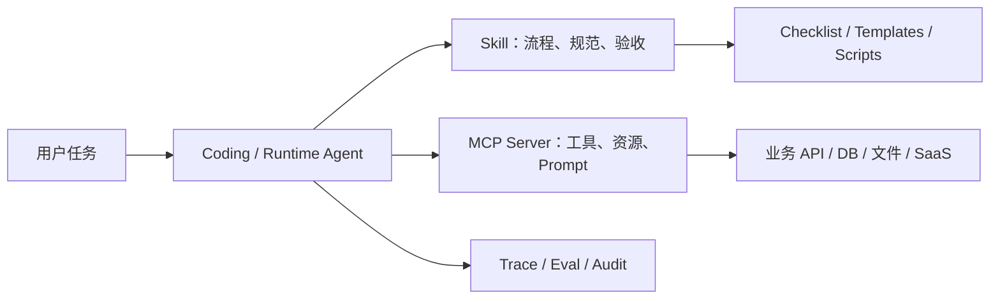

# MCP、Tools 与 Skills：Agent 扩展能力选型策略

> 目标：把“给 Agent 增加能力”拆成可判断的工程问题。什么时候写普通 tool，什么时候做 MCP Server，什么时候沉淀成 Skill，什么时候三者组合？

## 一句话结论

- **Tool**：适合单个应用内部的函数调用，边界由当前后端控制。
- **MCP Server**：适合把外部系统、数据源和动作能力标准化暴露给多个 AI 客户端。
- **Skill**：适合把重复的开发流程、项目规范、验收标准和领域知识打包给 Agent 使用。
- **组合方式**：Skill 负责“教 Agent 怎么做”，MCP 负责“给 Agent 可调用能力”，Tool Contract 负责“让调用可验证”。

## 选型矩阵

| 场景 | 推荐方案 | 原因 |
|---|---|---|
| 只在一个后端里调用一个函数 | 内部 Tool | 成本低、权限边界清晰、无需协议化 |
| 多个客户端都要访问同一套工具或数据 | MCP Server | 统一 discovery、schema、资源、prompt 和调用方式 |
| 任务流程反复出现，但每次都要靠提示词复制 | Skill | 把步骤、脚本、参考资料和验收标准版本化 |
| 需要把“创建 MCP Server”的经验复用给编码 Agent | Skill + MCP 模板 | Skill 负责询问需求、选择部署模型、生成脚手架 |
| 工具会写数据库、发消息、改文件 | MCP / Tool + 审批 + 审计 | 动作型能力必须有风险等级、用户确认、日志和回放 |

## 判断顺序

### 1. 先问：这是动作能力，还是流程知识？

如果问题是“让 Agent 能调用数据库 / GitHub / 文件系统 / 工单系统”，它更像 **Tool 或 MCP**。

如果问题是“让 Agent 每次都按同一套方式写周报、评审 PR、生成投标文件、构建 MCP Server”，它更像 **Skill**。

### 2. 再问：这个能力是否需要跨客户端复用？

如果只服务当前项目，内部 tool 就够。若希望 Claude、Codex、自研 Agent 或企业聊天应用都能接入同一套能力，就应该考虑 MCP Server。

### 3. 最后问：失败成本在哪里？

- 失败成本在“调用错工具” → 强化 tool schema、description、示例和测试。
- 失败成本在“流程漏步骤” → 沉淀 Skill checklist 和验收门禁。
- 失败成本在“越权或误操作” → 加 MCP 权限、approval、audit log、sandbox 和 revoke。

## MCP 不是万能插件市场

MCP 的价值不是“装更多工具”，而是让 Agent 能通过标准协议发现工具、资源和 prompt。官方文档把 MCP Server 的能力拆成三类：Tools、Resources、Prompts。工程上要分别治理：

| MCP 能力 | 工程治理重点 |
|---|---|
| Tools | 输入 schema、幂等性、风险等级、审批、超时、错误码、审计 |
| Resources | URI 设计、权限过滤、MIME type、缓存、敏感数据脱敏 |
| Prompts | 参数校验、版本、适用场景、可解释性、与资源/工具的绑定 |

## Skills 的价值是把经验变成“可触发的流程”

Agent Skills 官方格式强调一个 Skill 至少包含 `SKILL.md`，也可以带 `scripts/`、`references/`、`assets/`。这意味着 Skill 不只是提示词，而是一个小型可版本化工作流包。

一个好的 Skill 应该包含：

1. **触发边界**：什么任务应该使用，什么任务不该使用。
2. **默认流程**：优先路径，而不是把所有可选项平铺给 Agent。
3. **项目特有知识**：目录结构、命名约定、构建命令、常见坑。
4. **渐进加载**：大资料放进 `references/`，只在需要时读取。
5. **验证门禁**：完成前必须跑什么命令、检查什么输出。

## 推荐组合架构

这个组合让职责更清楚：

- Skill 不直接替代工具，而是告诉 Agent 如何规划、实现、验证。
- MCP 不直接替代知识库，而是提供标准化外部能力。
- Trace / Eval 负责证明结果可复盘。

## 项目作品集怎么讲

面试或作品集中不要只说“我接入了 MCP”。更好的表达是：

> 我把外部系统能力拆成 MCP Tools / Resources / Prompts，并为每个 Tool 定义输入 schema、风险等级、幂等性和错误码；同时把创建和测试 MCP Server 的流程沉淀成 Skill，确保后续新增工具时能复用同一套设计、测试和上线门禁。

## 参考资料

- [Model Context Protocol：What is MCP?](https://modelcontextprotocol.io/docs/getting-started/intro)
- [MCP Server Concepts](https://modelcontextprotocol.io/docs/learn/server-concepts)
- [Build an MCP Server](https://modelcontextprotocol.io/docs/develop/build-server)
- [Build with Agent Skills](https://modelcontextprotocol.io/docs/develop/build-with-agent-skills)
- [Agent Skills Overview](https://agentskills.io/)
- [Agent Skills Best Practices](https://agentskills.io/skill-creation/best-practices)
