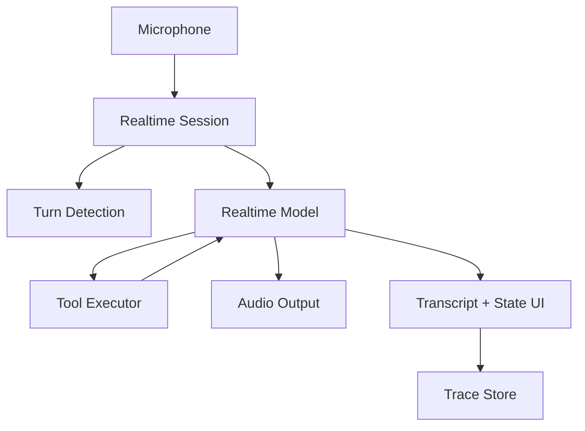

# Realtime Voice Agent Engineering：实时语音 Agent 怎么设计

## 这篇文章解决什么问题

实时语音 Agent 不只是把 ASR + LLM + TTS 串起来。用户会打断、环境会噪声、模型会延迟、工具调用会卡住、对话需要状态记忆，高风险动作还要确认。

Realtime Voice Agent Engineering 的目标是把语音 Agent 当成低延迟交互系统来设计。

## 语音 Agent 和文本 Agent 的差异

| 维度 | 文本 Agent | 语音 Agent |
|---|---|---|
| 输入 | 用户一次性输入 | 连续音频流 |
| 输出 | 可等待完整答案 | 需要边生成边播放 |
| 中断 | 用户发新消息 | 用户随时打断 |
| 错误恢复 | 可显示错误文本 | 要用自然语言澄清 |
| 延迟感知 | 秒级可接受 | 百毫秒到低秒级更敏感 |
| 工具调用 | 卡片展示 | 需要语音提示和 UI 同步 |

## 系统架构

## 关键工程问题

| 问题 | 设计 |
|---|---|
| 端到端延迟 | WebRTC / streaming、短上下文、低延迟工具 |
| 用户打断 | barge-in 检测，停止 TTS，保留新指令 |
| 噪声和误识别 | 关键动作二次确认，UI 展示 transcript |
| 工具调用卡住 | 语音提示“我正在查询”，超时后降级 |
| 高风险动作 | 必须口头确认 + UI 审批按钮 |
| 多轮状态 | session state + summary memory |
| 隐私 | 不默认长期保存音频，只保存必要 transcript / trace |

## Voice UI 要展示什么

即使是语音产品，也需要屏幕辅助：

- 实时 transcript。
- Agent 当前状态。
- 正在调用的工具。
- 关键信息确认卡。
- 引用和证据面板。
- 静音、打断、结束会话按钮。

纯语音黑盒不适合高风险业务。

## 工具调用策略

| 工具类型 | 语音策略 |
|---|---|
| 只读查询 | 可直接执行，但要播报“我查一下” |
| 敏感读取 | 说明读取范围，必要时确认 |
| 可逆写入 | 先总结动作，再要求确认 |
| 高影响动作 | 必须 UI 审批，不只靠语音确认 |
| 长耗时工具 | 转异步任务，后续通知用户 |

## 评测指标

| 指标 | 说明 |
|---|---|
| first_audio_latency | 用户停顿后多久开始回应 |
| interruption_success | 用户打断后是否停止旧回复 |
| task_success | 语音任务完成率 |
| correction_rate | 用户纠正识别或意图的比例 |
| tool_success | 工具调用成功率 |
| confirmation_accuracy | 高风险确认是否准确 |
| user_dropoff | 用户在哪个阶段离开 |

## 面试表达

可以这样讲：

> 实时语音 Agent 的核心不是简单 ASR + LLM + TTS，而是低延迟、多轮状态、打断处理和高风险确认。我会把语音流、转写、工具调用、UI 状态和 Trace 串起来：只读工具可直接执行，高风险动作必须语音确认加 UI 审批，所有关键动作都进入审计和评测。

## 落地检查清单

- [ ] 是否支持用户打断并停止旧回复？
- [ ] 是否展示实时 transcript 和状态？
- [ ] 高风险工具是否有确认和审批？
- [ ] 长工具是否能异步化？
- [ ] 是否评测 first_audio_latency 和 interruption_success？
- [ ] 是否避免长期保存原始音频？