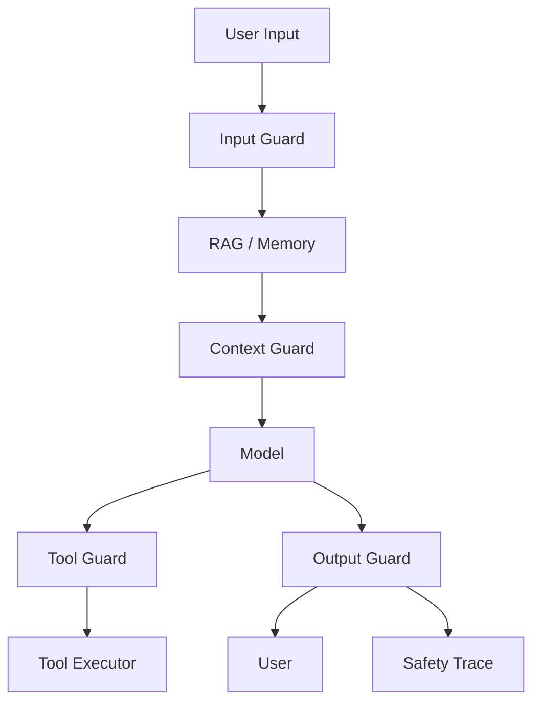

# Agent Guardrails Pipeline：Agent 防护流水线怎么设计

## 这篇文章解决什么问题

Guardrails 不是单个正则，也不是系统提示里写“不要做坏事”。生产级 Agent 需要在输入、检索、上下文、工具、输出和反馈多个阶段设置防护点。

Agent Guardrails Pipeline 的目标是把安全从 Prompt 变成可测试、可审计、可回滚的工程流水线。

## 防护位置

| 阶段 | 防护点 |
|---|---|
| Input | PII、越权请求、恶意指令、任务边界 |
| Retrieval | untrusted content、权限过滤、文档状态 |
| Context Pack | instruction/evidence 分离、token budget |
| Tool Call | schema、scope、risk、approval、args_hash |
| Output | schema、citation、PII、policy、unsafe claim |
| Feedback | 负反馈分诊、安全样本入库 |

## Pipeline 设计

## Guardrail 输出结构

| 字段 | 说明 |
|---|---|
| guardrail_id | 防护规则 ID |
| stage | input、context、tool、output |
| decision | allow、block、rewrite、approval_required |
| reason_code | injection、pii、permission、unsafe_tool |
| severity | low、medium、high、critical |
| evidence_refs | 触发依据 |
| fallback | 拒答、澄清、人工接管 |
| policy_version | 策略版本 |

## 不同风险的处理

| 风险 | 处理 |
|---|---|
| 不清楚任务 | ask_clarification |
| 轻微格式问题 | rewrite / repair |
| 无权限数据 | block + explain |
| 高风险工具 | approval_required |
| Prompt Injection | ignore untrusted instruction + log |
| PII 泄漏 | redact + safe answer |
| 危险操作 | block 或 human_review |

## 评测

Guardrails 也要有评测集：

- prompt injection 样本。
- 越权数据请求。
- PII 输入和输出。
- 高风险工具调用。
- RAG 冲突证据。
- 无答案问题。
- 格式破坏样本。

## 面试表达

可以这样讲：

> 我不会把 Guardrails 当成一句系统提示，而是设计成输入、检索、上下文、工具和输出多阶段流水线。每个 guardrail 都返回 decision、reason_code、severity、fallback 和 policy_version，并进入 Trace。这样安全策略可以被评测、审计、灰度和回滚。

## 落地检查清单

- [ ] 是否有 input/context/tool/output 多阶段防护？
- [ ] 每次拦截是否记录 reason_code 和 policy_version？
- [ ] 高风险工具是否返回 approval_required？
- [ ] 输出是否检查 schema、citation、PII 和 policy？
- [ ] 是否有安全评测集和回归样本？
- [ ] 是否能按策略版本灰度和回滚？