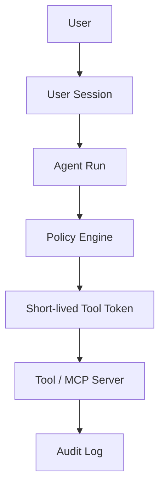

# Agent Identity and RBAC：Agent 身份与权限怎么设计

## 这篇文章解决什么问题

生产级 Agent 不是“系统账号 + 全局 API Key”。Agent 会代表用户读取数据、调用工具、创建工单、发送消息、访问 MCP Server。如果没有身份和权限设计，就会出现越权读取、工具滥用、审计不清和跨租户泄漏。

Agent Identity and RBAC 的目标是回答：Agent 以谁的身份执行？能访问什么？谁来审批？如何审计？

## 三种身份

| 身份 | 含义 | 用途 |
|---|---|---|
| user_identity | 真实用户身份 | 数据访问、业务权限 |
| agent_identity | Agent 服务身份 | 执行任务、记录审计 |
| tool_identity | 工具短期凭证 | 调用外部服务 |

不要用一个长期全局 token 代表所有用户和所有工具。

## 权限模型

| 维度 | 示例 |
|---|---|
| tenant | 租户边界 |
| workspace | 项目/团队空间 |
| role | viewer、operator、admin |
| scope | read:docs、write:tickets、send:email |
| resource | document_id、ticket_id、database |
| action | read、create、update、delete、send |
| risk_level | R0-R4 |

## 执行链路

## Token 设计

| Token | 生命周期 | 内容 |
|---|---|---|
| user_session | 登录会话 | user_id、tenant、roles |
| agent_run_token | 单次 run | run_id、user_scope、budget |
| tool_execution_token | 单次工具调用 | tool、scope、args_hash、expires_at |

工具 token 应该短期、最小权限、绑定 args_hash 和 approval_id。

## 审批模型

| 场景 | 是否需要审批 |
|---|---|
| 读取公开文档 | 不需要 |
| 读取敏感客户资料 | 可能需要 |
| 创建可撤销草稿 | 可低风险执行 |
| 发送邮件/消息 | 需要用户确认 |
| 删除、付款、发布 | 强审批 + 审计 |

审批记录要包含：approver、tool、args_summary、args_hash、risk_level、expires_at。

## 审计日志

| 字段 | 说明 |
|---|---|
| actor_user_id | 真实用户 |
| actor_agent_id | 哪个 Agent |
| action | 做了什么 |
| target | 操作对象 |
| tool_name | 调用工具 |
| scope | 权限范围 |
| decision | allow、deny、approval_required |
| policy_version | 策略版本 |
| run_id | 关联 Trace |

## 面试表达

可以这样讲：

> 我不会让 Agent 使用全局管理员 token。每次 Agent run 都绑定用户身份、租户、角色和预算；工具调用前由 Policy Engine 判断 scope、resource、risk_level 和 approval。真正执行工具时使用短期 tool_execution_token，并绑定 tool、args_hash、approval_id 和 expires_at。这样可以做到最小权限、可审批、可审计和跨租户隔离。

## 落地检查清单

- [ ] Agent run 是否绑定真实 user_identity？
- [ ] 工具 token 是否短期且最小权限？
- [ ] 高风险工具是否绑定 approval_id 和 args_hash？
- [ ] 审计日志是否同时记录 user、agent、tool？
- [ ] 是否按 tenant/workspace/resource 做权限过滤？
- [ ] 是否禁止全局管理员 token 直接给 Agent 使用？