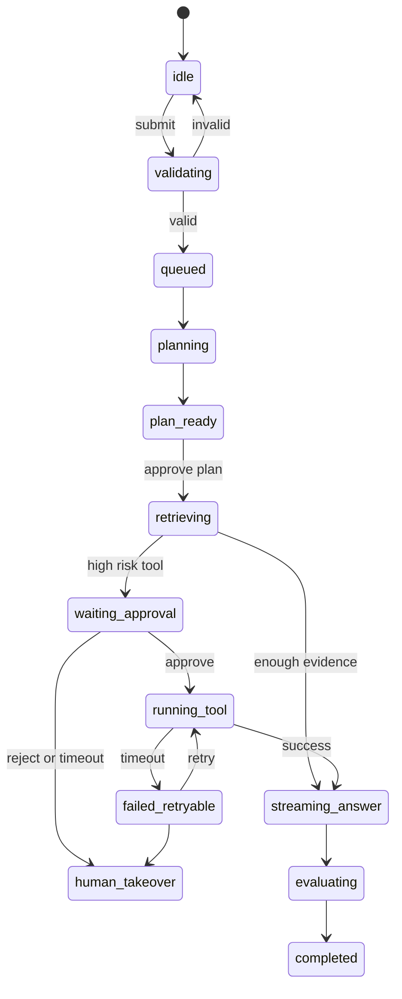

# Agent UI State Machine：Agent 前端状态机怎么设计

## 这篇文章解决什么问题

Agent 前端最容易出问题的地方不是样式，而是状态。一个长任务 Agent 可能经历排队、规划、检索、工具调用、等待审批、失败重试、人工接管、完成和回放。如果前端只靠几个 boolean，比如 loading、done、error，很快就会混乱。

Agent UI State Machine 的目标是把前端状态和后端 Run 状态对齐，让用户界面可解释、可恢复、可测试。

## 不要只用 loading

| 简化状态 | 问题 |
|---|---|
| loading=true | 无法区分排队、检索、工具调用、等待审批 |
| error=true | 无法区分可重试、需用户输入、需人工接管 |
| completed=true | 无法展示证据、评测、后续动作 |
| streaming=true | 工具调用和模型流式输出容易混在一起 |

## 推荐状态模型

| 状态 | 含义 | UI 表达 | 可执行动作 |
|---|---|---|---|
| idle | 尚未提交任务 | 输入框、模板选择 | submit |
| validating | 前端/后端校验输入 | 字段校验、缺失提示 | edit、submit |
| queued | 已进入队列 | 队列卡、预计等待 | cancel |
| planning | Agent 生成计划 | Plan skeleton | cancel |
| plan_ready | 计划可查看 | Plan Preview | approve_plan、edit_constraints |
| retrieving | 正在检索证据 | Evidence loading | cancel |
| waiting_approval | 等待用户审批工具 | Approval Card | approve、reject |
| running_tool | 工具执行中 | Tool Call Card | cancel、view_args |
| streaming_answer | 模型生成中 | Streaming answer | stop |
| evaluating | 自动评测中 | Eval Badge loading | skip_eval |
| human_takeover | 转人工 | Handoff card | assign、resume |
| failed_retryable | 可重试失败 | Error card + retry | retry、handoff |
| failed_terminal | 不可恢复失败 | Error card + export trace | export_trace、new_task |
| completed | 已完成 | Answer + Evidence + Trace | export、rate、followup |

## 状态转换示例

## 前端数据结构

| 字段 | 说明 |
|---|---|
| run_id | 当前任务唯一 ID |
| state | 当前 UI 状态 |
| step_id | 当前 Agent step |
| status_reason | 为什么进入该状态 |
| visible_summary | 给用户看的状态摘要 |
| allowed_actions | 当前状态允许的按钮 |
| evidence_refs | 当前可展示证据 |
| approval_request | 当前审批卡内容 |
| error | 统一错误结构 |
| trace_ref | Trace 链接或导出引用 |

## 和后端状态对齐

前端不要自己猜 Agent 执行状态。后端应该通过 HTTP polling、SSE 或 WebSocket 推送 run event：

| 后端事件 | 前端状态 |
|---|---|
| run.created | queued |
| step.plan.started | planning |
| step.plan.completed | plan_ready |
| retrieval.started | retrieving |
| approval.requested | waiting_approval |
| tool.started | running_tool |
| model.stream.started | streaming_answer |
| eval.started | evaluating |
| run.completed | completed |
| run.failed.retryable | failed_retryable |
| run.failed.terminal | failed_terminal |

## 测试重点

| 测试 | 目标 |
|---|---|
| 状态快照测试 | 每个状态都能渲染正确组件 |
| 非法转移测试 | waiting_approval 不能直接 completed |
| 断线恢复测试 | 刷新页面后按 run_id 恢复状态 |
| 审批超时测试 | 超时后进入 human_takeover 或 failed_retryable |
| 工具错误测试 | 展示 error code、retry 和 trace |

## 面试表达

可以这样讲：

> 我没有用一个 loading 状态覆盖所有 Agent 执行过程，而是把前端建模成和后端 run event 对齐的状态机。排队、规划、检索、审批、工具执行、生成、评测、失败重试、人工接管都有明确状态和允许动作，因此界面可恢复、可测试，也能展示 Agent 执行过程。

## 落地检查清单

- [ ] 是否区分 queued、planning、waiting_approval、running_tool？
- [ ] 是否有 allowed_actions 控制按钮？
- [ ] 刷新页面后能否用 run_id 恢复？
- [ ] 错误是否区分 retryable 和 terminal？
- [ ] 前端状态是否来自后端事件而不是自己猜？