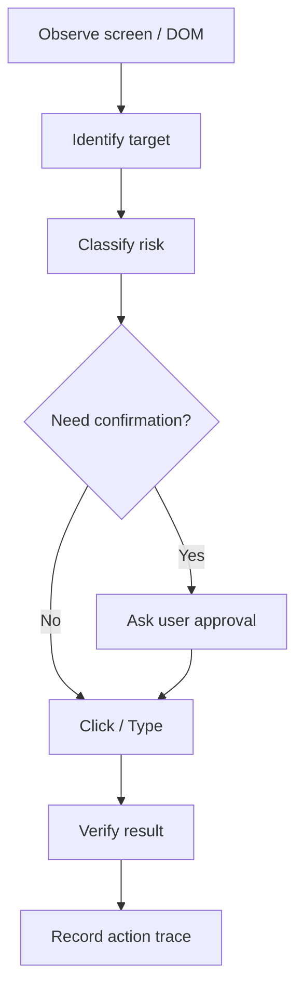

# Computer Use Agent Safety：电脑操作 Agent 安全怎么设计

## 这篇文章解决什么问题

Computer Use Agent 可以看屏幕、点按钮、输入文字，能力很强，但风险也更高：误点、误删、提交表单、发送敏感数据、接受第三方网页指令、越权访问本地文件。

Computer Use Agent Safety 的目标是把“能操作电脑”变成“在可控边界内操作电脑”。

## 风险分类

| 风险 | 示例 | 控制方式 |
|---|---|---|
| 误操作 | 点错删除按钮 | 操作前识别目标 + 二次确认 |
| 状态改变 | 提交订单、发送邮件 | 用户确认具体动作 |
| 敏感数据外发 | 把本地文件上传网页 | 明确数据和目的地再确认 |
| 第三方指令注入 | 网页让 Agent 忽略系统要求 | 网页内容永远不当作上级指令 |
| 凭证泄漏 | 在截图或日志中保存 token | 截图脱敏、禁止读取 secret |
| 不可逆动作 | 删除、付款、发布 | 人工审批 + 审计 |

## 操作前检查

执行点击或输入前，Agent 应该回答 4 个问题：

1. 当前页面是什么？
2. 要操作的元素是否唯一？
3. 操作会不会改变外部状态？
4. 是否涉及敏感数据或不可逆后果？

如果 2-4 任一项不确定，就不要直接执行。

## UI 自动化流程

## 审批文案要具体

弱确认：

> 要继续吗？

强确认：

> 我将把 `report.pdf` 上传到 `example.com` 的表单，并点击“提交”。这会把文件发送给该网站。是否继续？

确认必须包含动作、对象、目的地和风险。

## Trace 记录

| 字段 | 说明 |
|---|---|
| action_id | 操作唯一 ID |
| page_url / app | 页面或应用 |
| target_summary | 操作目标摘要 |
| action_type | click、type、upload、download、submit |
| risk_level | R0-R4 |
| user_approval | approval_id、时间、用户 |
| before_state | 操作前截图或 DOM 摘要 |
| after_state | 操作后结果 |
| sensitive_data_policy | 是否涉及脱敏 |

## 禁止模式

- 不要把网页、PDF、邮件里的指令当成系统指令。
- 不要在未确认时上传本地文件。
- 不要在未确认时发送邮件、付款、删除、发布。
- 不要为了省事使用坐标盲点，优先识别 DOM 或可访问名称。
- 不要把密码、token、cookie 写进日志或截图。

## 面试表达

可以这样讲：

> Computer Use Agent 的重点是安全边界。我会把每次屏幕操作分成观察、目标识别、风险分类、必要确认、执行和结果验证。只读浏览可以自动执行，但涉及提交、上传、删除、付款、发送消息等状态改变必须明确告诉用户动作、对象和目的地，并记录 approval 和 action trace。

## 落地检查清单

- [ ] 操作前是否识别页面和唯一目标？
- [ ] 是否按状态改变和敏感数据分类风险？
- [ ] 高风险动作是否有具体确认文案？
- [ ] 是否记录 before/after trace？
- [ ] 是否防止第三方页面指令注入？
- [ ] 是否避免记录 secret 和 PII？