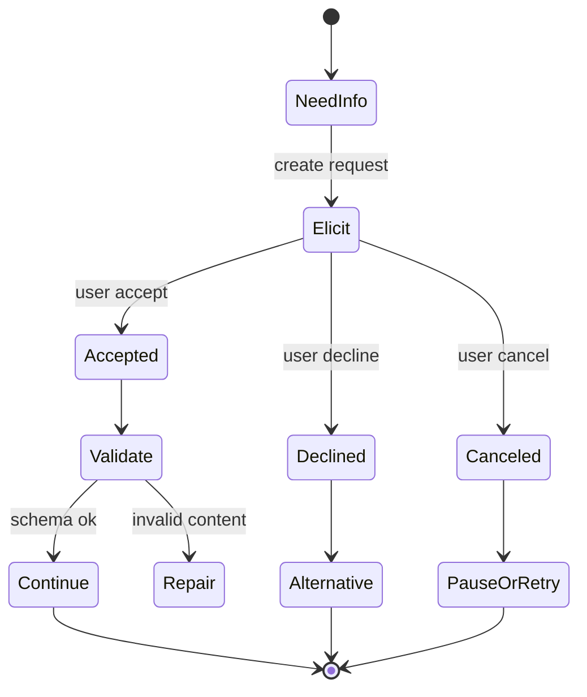

# MCP Elicitation 交互设计：让 Server 安全地向用户补信息

Elicitation 是 MCP 中用于“Server 通过 Client 请求用户补充信息”的交互机制。它适合确认缺失参数、选择候选项、补充非敏感偏好；不适合索要密码、token、支付凭证等敏感信息。

## 适用场景

| 场景 | 是否适合 Elicitation | 说明 |
|---|---|---|
| 缺少 GitHub 仓库名 | 适合 | 结构化表单补参数 |
| 选择工单优先级 | 适合 | enum / boolean / number 可以直接约束 |
| 输入 API Key | 不适合 | 应走 secret manager 或 OAuth，不应进入普通表单 |
| 支付确认 | 不适合普通表单 | 应走专门授权、URL 或业务系统确认 |
| 选择多个复杂对象 | 谨慎 | 当前表单 schema 更适合扁平结构，复杂 UI 应考虑 MCP App / widget |

## 交互状态机



## Schema 设计原则

1. **字段少**：一次只问完成当前步骤所需的最小信息。
2. **类型窄**：优先 enum、number range、date format，少用自由文本。
3. **文案明确**：说明哪个 server 在请求、为什么需要、怎么使用。
4. **允许拒绝**：decline 和 cancel 是正常路径，不是异常。
5. **不收秘密**：敏感凭证走 secret / OAuth / URL 授权。

## 错误处理

| 用户动作 | Server 处理 |
|---|---|
| accept + valid | 继续调用后续 tool 或读取 resource |
| accept + invalid | 返回字段级错误，不执行副作用动作 |
| decline | 解释无法继续的部分，并提供替代方案 |
| cancel | 暂停当前流程，保留可恢复状态 |
| timeout | 标记为用户未确认，不自动默认同意 |

## UI 文案模板

```text
[server-name] 需要你补充以下信息，用于 [具体目的]。
这些信息将用于 [下一步动作]，不会用于 [排除用途]。
你可以提交、拒绝或取消；拒绝后系统将提供替代路径。
```

## 与审批的区别

- **Elicitation**：补信息，解决“参数不够”。
- **Approval**：确认动作，解决“是否允许执行”。
- **Auth**：证明身份和授权范围，解决“有没有权限”。

不要把三者混在一起。比如“请填写 API Key”不是 elicitation；“是否删除生产数据”也不只是 elicitation，而是高风险 approval。

## 工程清单

- [ ] client 初始化时声明是否支持 elicitation。
- [ ] server 对不支持 elicitation 的 client 有 fallback。
- [ ] schema 只包含扁平、简单、必要字段。
- [ ] accept / decline / cancel 都有测试。
- [ ] 不通过 elicitation 收集 secret。
- [ ] 每次请求记录 server、purpose、field names、用户动作和 trace id。
- [ ] rate limit 防止 server 频繁打扰用户。

## 面试表达

> 我会把 Elicitation 设计成受控表单交互：只补非敏感、当前步骤必要的信息；accept、decline、cancel 都是显式状态；敏感凭证走 OAuth 或 Secret Manager；高风险动作走审批，而不是把所有交互都塞进一个表单。

## 参考资料

- [MCP Elicitation](https://modelcontextprotocol.io/docs/concepts/elicitation)
- [MCP Server Concepts](https://modelcontextprotocol.io/docs/learn/server-concepts)
- [Build with Agent Skills](https://modelcontextprotocol.io/docs/develop/build-with-agent-skills)
