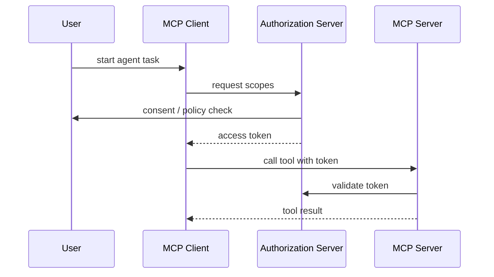

# MCP OAuth Authorization Design：MCP 授权怎么设计

## 这篇文章解决什么问题

MCP Server 接入越多，授权问题越复杂：Agent 代表谁调用？MCP Server 如何验证客户端？用户如何授权范围？工具调用凭证如何过期？高风险工具如何绑定审批？

MCP OAuth Authorization Design 的目标是把 MCP 授权从“配置一个 API Key”提升为可审计的授权链路。

## 授权参与方

| 参与方 | 职责 |
|---|---|
| User | 授权某个 Agent / Client 访问能力 |
| MCP Client | 代表 Agent 发现和调用 MCP Server |
| Authorization Server | 颁发和校验访问令牌 |
| MCP Server | 暴露 Tools / Resources / Prompts |
| Policy Engine | 判断 scope、risk、tenant、approval |

## Scope 设计

| Scope | 说明 |
|---|---|
| docs:read | 读取文档资源 |
| tickets:read | 读取工单 |
| tickets:write | 创建或更新工单 |
| email:send | 发送邮件 |
| database:query | 查询数据库 |
| admin:manage | 管理配置，高风险 |

Scope 要细，不要一个 `mcp:all` 解决所有问题。

## 授权链路

## Tool 调用还需要二次策略

OAuth token 只能证明“有某些 scope”，不代表每次工具调用都安全。执行前还要校验：

- tenant 是否匹配。
- resource 是否在用户权限范围内。
- action 风险等级。
- args_hash 是否和审批一致。
- token 是否过期。
- 当前 run 是否超过预算。

## Token 最小化

| 设计 | 好处 |
|---|---|
| 短期 access token | 降低泄漏影响 |
| refresh token 不暴露给 Agent | 避免长期凭证泄漏 |
| token 绑定 run_id | 方便审计和撤销 |
| token 绑定 scope | 最小权限 |
| token 绑定 audience | 防止拿去调用其它服务 |

## 常见错误

| 错误 | 风险 |
|---|---|
| 所有 MCP Server 共用一个 API Key | 无法区分用户和租户 |
| Scope 太粗 | 工具越权 |
| Token 长期有效 | 泄漏后难以止血 |
| MCP Server 不校验 audience | token 被重放到其它服务 |
| 审批只在前端做 | 后端可被绕过 |

## 面试表达

可以这样讲：

> MCP 授权不能只靠一个全局 API Key。我会把 MCP Client、Authorization Server、MCP Server 和 Policy Engine 分开：用户授权细粒度 scope，Client 获取短期 access token，Server 校验 token、audience、tenant 和 resource，高风险工具还要绑定 approval_id 和 args_hash。这样 MCP 工具调用才有最小权限和审计边界。

## 落地检查清单

- [ ] Scope 是否细粒度？
- [ ] Token 是否短期并绑定 audience？
- [ ] MCP Server 是否校验 tenant/resource？
- [ ] 高风险工具是否仍走 approval？
- [ ] 是否禁止全局 API Key 代表所有用户？
- [ ] 是否能按 run_id 撤销或审计 token？