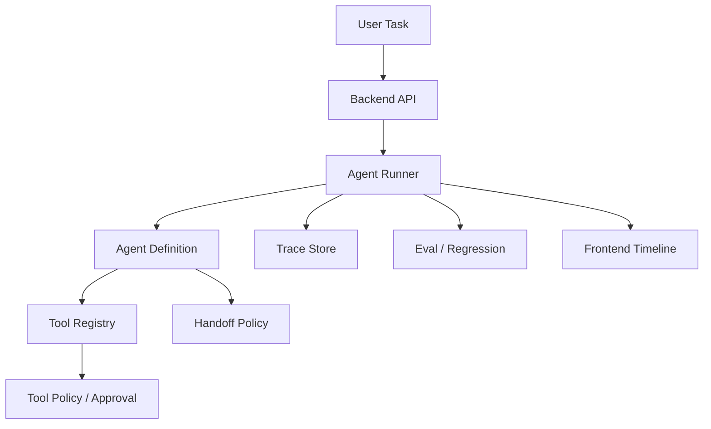

# OpenAI Agents SDK Engineering：Agents SDK 工程化怎么落地

## 这篇文章解决什么问题

Agents SDK 能把模型、工具、handoff、guardrail、trace 等能力组织成 Agent Runtime，但项目落地时不能只会写一个 hello world。真正要考虑的是：Agent 边界怎么定义、工具怎么治理、handoff 怎么验收、trace 怎么入库、失败怎么恢复、成本和延迟怎么观察。

这篇文章把 Agents SDK 当作工程框架来拆，而不是只当作模型调用封装。

## Agents SDK 适合解决什么

| 场景 | 为什么适合 |
|---|---|
| 单 Agent + 多工具 | 统一描述工具、输入输出和执行 Trace |
| 多 Agent 分工 | 用 handoff 明确职责边界和交接条件 |
| 需要可观测性 | 每次 run / step / tool call 都可以记录 |
| 需要安全边界 | guardrail、tool policy、approval 可以接入运行链路 |
| 需要面试展示 | Trace 和 handoff 可以清楚解释系统行为 |

## Agent 定义要包含什么

| 字段 | 说明 |
|---|---|
| name | Agent 角色名，不要太泛 |
| instructions | 任务边界、禁止动作、输出要求 |
| tools | 可调用工具，按风险分级 |
| handoffs | 可以交给哪些 Agent |
| output_type | 结构化输出 schema |
| guardrails | 输入/输出安全检查 |
| model_settings | 模型、温度、token、超时 |

不要把所有能力都塞进一个万能 Agent。越通用，越难测试、越难授权、越难解释。

## 工程化分层

## Handoff 设计

多 Agent 不是“多个角色聊天”，而是有验收条件的交接。

| 字段 | 说明 |
|---|---|
| from_agent | 发起交接的 Agent |
| to_agent | 接收 Agent |
| reason | 为什么要交接 |
| evidence_refs | 交接依据 |
| constraints | 不能违反的限制 |
| acceptance_criteria | 接收方完成标准 |
| return_policy | 是否需要交回原 Agent |

## Trace 需要落库的内容

| Trace 事件 | 作用 |
|---|---|
| run.created | 关联用户任务、租户、版本 |
| step.started / completed | 展示执行时间线 |
| tool.called | 记录工具、参数摘要、风险等级 |
| handoff.created | 记录交接原因和目标 Agent |
| guardrail.triggered | 记录安全拦截 |
| run.failed | 转成失败样本和回归测试 |
| run.completed | 记录输出和指标 |

## 常见坑

- 把 instructions 写成一大段“万能提示词”，没有工具边界。
- handoff 没有 acceptance criteria，导致多 Agent 互相甩锅。
- tool 返回没有标准结构，Trace 和前端无法复用。
- guardrail 只在 Prompt 里写，执行层没有校验。
- 没有把失败 run 转成 eval case。

## 面试表达

可以这样讲：

> 我使用 Agents SDK 时重点不是调用模型，而是把 Agent 定义、工具注册、handoff、guardrail 和 trace 组成一个可治理 Runtime。每次 run 都会记录 step、tool call、handoff 和 guardrail 事件，高风险工具接入审批，失败样本进入回归评测，这样多 Agent 系统才可解释、可恢复、可上线。

## 落地检查清单

- [ ] 每个 Agent 是否有清楚职责和禁止动作？
- [ ] Tool 是否接入 risk_level、schema_version 和 approval？
- [ ] Handoff 是否有 evidence_refs 和 acceptance_criteria？
- [ ] Trace 是否能展示到前端时间线？
- [ ] Guardrail 是否在执行层生效？
- [ ] 失败 run 是否能进入 eval / regression？