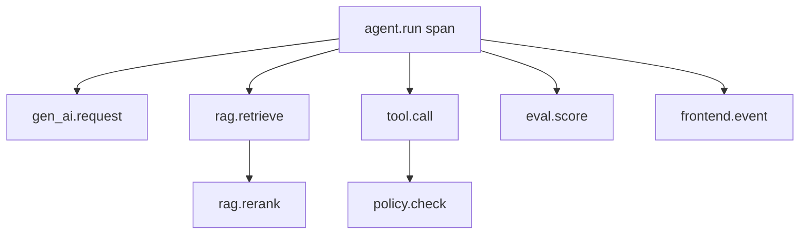

# OpenTelemetry GenAI Observability：大模型应用可观测怎么接入

## 这篇文章解决什么问题

大模型应用的可观测不能只看 HTTP 200。一次 Agent Run 里可能有模型调用、RAG 检索、rerank、工具调用、审批、重试、评测和前端等待。OpenTelemetry 的价值是把这些事件用统一 Trace / Metrics / Logs 串起来。

这篇文章关注如何用 GenAI 语义约定设计 LLM / Agent 可观测。

## 需要观测什么

| 层级 | 指标 / Trace |
|---|---|
| LLM 调用 | model、provider、tokens、latency、finish_reason |
| RAG | query、retriever、top_k、hit_count、rerank_latency |
| Tool | tool_name、status、latency、error_code |
| Agent Step | step_type、state、retry_count、handoff |
| Safety | guardrail_triggered、policy_denied、redaction |
| Cost | cost_per_request、cost_per_run、cache_hit |
| UX | first_token_latency、time_to_complete、handoff_rate |

## Trace 结构

## Span 属性建议

| 属性 | 示例 |
|---|---|
| gen_ai.system | openai |
| gen_ai.request.model | gpt-4.1 |
| gen_ai.usage.input_tokens | 1200 |
| gen_ai.usage.output_tokens | 300 |
| agent.run_id | run_123 |
| agent.step_type | tool_call |
| rag.index_version | kb_2026_06 |
| tool.name | create_ticket |
| tool.risk_level | R3 |
| policy.decision | approval_required |
| eval.score | 0.82 |

注意不要把完整 Prompt、用户隐私和 Secret 放进 span attribute。

## Metrics 面板

| 面板 | 指标 |
|---|---|
| 成本 | cost_per_run、token_per_success、cache_saving |
| 延迟 | p50/p95 latency、first_token_latency、tool_latency |
| 质量 | task_success、grounding_score、format_pass_rate |
| RAG | recall@k、citation_coverage、no_answer_rate |
| Tool | tool_success_rate、approval_timeout、retry_rate |
| 安全 | policy_denied、injection_detected、pii_redacted |

## 日志分级

| 日志 | 是否可长期保存 |
|---|---|
| request_id / run_id | 可以 |
| token 数和成本 | 可以 |
| 参数摘要 | 脱敏后可以 |
| 原始用户输入 | 谨慎，按数据治理 |
| Prompt 完整内容 | 谨慎，可能含策略和隐私 |
| Secret / Token | 禁止 |

## 面试表达

可以这样讲：

> 我会用 OpenTelemetry 思路把 Agent Run 拆成 agent.run、gen_ai.request、rag.retrieve、tool.call、policy.check 和 eval.score 等 span。每个 span 记录模型、token、延迟、工具、风险等级、策略决策和评测分数，但不记录原始 Secret 和敏感 Prompt。这样可以从一次用户反馈 drill down 到模型调用、检索、工具和安全策略。

## 落地检查清单

- [ ] 每次 Agent run 是否有统一 trace_id / run_id？
- [ ] LLM 调用是否记录模型、token、latency、cost？
- [ ] RAG / Tool / Policy 是否有独立 span？
- [ ] 是否有成本、延迟、质量、安全四类 dashboard？
- [ ] 是否避免记录 PII、Secret 和完整敏感 Prompt？
- [ ] 用户反馈是否能关联到 Trace？