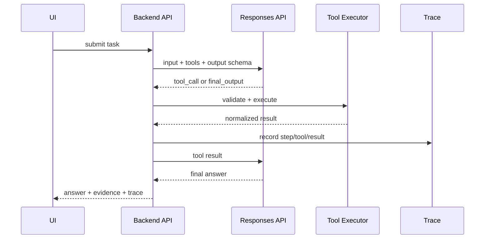

# Responses API Tool Orchestration：Responses API 工具编排怎么设计

## 这篇文章解决什么问题

Responses API 把文本、多模态输入、工具调用、结构化输出等能力放在统一接口里。工程落地时，关键不是“能不能调用工具”，而是工具调用如何被路由、校验、执行、重试、审计和展示。

这篇文章关注 Responses API 作为 LLM Gateway / Agent Runtime 的接口层怎么设计。

## 典型调用链路

## 工具定义不是越多越好

| 问题 | 结果 |
|---|---|
| 一次暴露几十个工具 | 模型选择困难，误调用增加 |
| 工具描述太短 | 模型不知道何时使用 |
| 参数过于自由 | 后端校验压力大，安全风险高 |
| 输出无 schema | 后续步骤无法稳定消费 |

推荐按任务类型动态选择 tools，而不是全局工具全量暴露。

## Tool Router

在调用 Responses API 前先做 Tool Router：

| 路由维度 | 示例 |
|---|---|
| task_type | rag_qa、ticket_create、data_query、code_review |
| user_role | viewer、operator、admin |
| risk_level | 只读、可逆写、高影响写 |
| tenant_policy | 某租户禁用外发工具 |
| budget | 高成本工具需要显式确认 |

## 执行层必须做二次校验

即使模型返回了 tool_call，也不能直接执行：

1. 校验 tool_name 是否在本次允许列表。
2. 校验参数 schema。
3. 校验 tenant / role / scope。
4. 计算 args_hash。
5. 判断 risk_level 是否需要 approval。
6. 执行工具并标准化输出。
7. 把结果作为 tool result 传回模型。

## 结构化输出

Responses API 的价值之一是让最终输出进入业务系统。建议最终输出包括：

| 字段 | 说明 |
|---|---|
| answer | 给用户看的答案 |
| confidence | 置信度或质量等级 |
| evidence_refs | 引用、工具结果、Trace ID |
| next_actions | 用户可执行下一步 |
| safety_flags | 风险和拦截信息 |
| cost_summary | 成本和延迟摘要 |

## 前端展示

前端不要只展示最终 answer，还要展示：

- 工具调用卡片。
- 参数摘要。
- 审批状态。
- 证据引用。
- 失败重试入口。
- Trace timeline。

这会让工具调用从黑盒变成用户可理解的流程。

## 面试表达

可以这样讲：

> 我使用 Responses API 时不会把所有工具一次性暴露给模型，而是先根据任务、角色、租户策略和风险等级做 Tool Router。模型返回 tool_call 后，后端执行层还会做 schema、权限、risk、approval 和 args_hash 校验，再把标准化工具结果传回模型。这样工具调用既灵活，也有安全和审计边界。

## 落地检查清单

- [ ] 是否按任务动态选择 tools？
- [ ] tool_call 是否经过执行层二次校验？
- [ ] 高风险工具是否需要 approval？
- [ ] 工具输出是否标准化？
- [ ] 最终输出是否有 schema 和 evidence_refs？
- [ ] Trace 是否记录每次 tool_call？